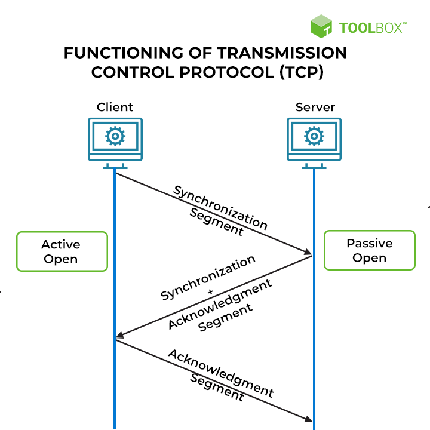
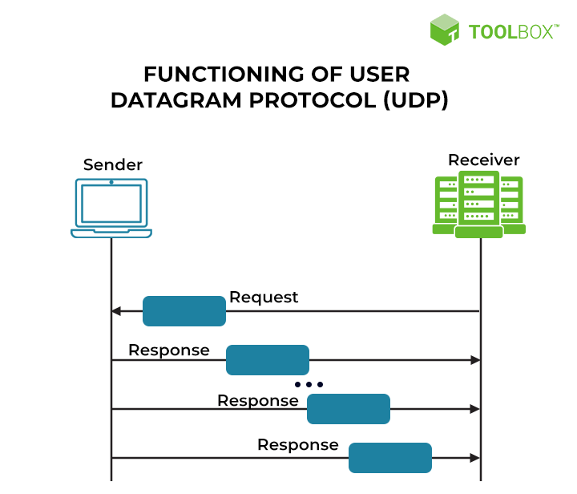
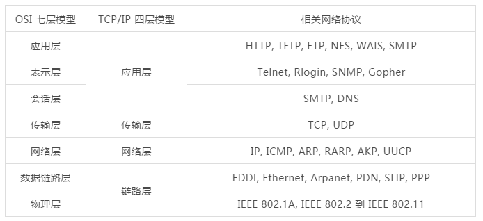

# 用 Rust 带你了解 TCP 和 UDP

## 前言：Rust 与网络世界的基石——TCP 和 UDP

互联网世界中两位至关重要的“信使”——TCP（传输控制协议）和 UDP（用户数据报协议）。这两个协议就像一对形影不离的兄弟，共同肩负着网络数据传输的重任，却又因其各自的特性而扮演着不同的角色。今天我们探寻一下 TCP 和 UDP 这两个兄弟的区别以及它们是如何高效可靠的传递信息的。相信通过今天的探讨，你将对这两个核心协议有更清晰、更深刻的认识。

**本文会使用Rust 语言进行 TCP 和 UDP 网络连接代码演示。**Rust 在网络编程领域的主要优势在于其在保证安全性和可靠性的前提下，提供了接近底层语言的性能。其现代化的并发模型和强大的生态系统也使得构建复杂、高性能的网络应用变得更加高效和可靠。

[本文源码](https://github.com/BruceZhang54110/free_rs)

##  什么是TCP（Transmission Control Protocol） ?

**传输控制协议**（英语：**T**ransmission **C**ontrol **P**rotocol，缩写：**TCP**）是一种面向连接的、可靠的、基于[字节流](https://zh.wikipedia.org/wiki/字節流)的[传输层](https://zh.wikipedia.org/wiki/传输层)[通信协议](https://zh.wikipedia.org/wiki/通信协议)，由[IETF](https://zh.wikipedia.org/wiki/IETF)的[RFC](https://zh.wikipedia.org/wiki/RFC) [793](https://datatracker.ietf.org/doc/html/rfc793)定义。在简化的计算机网络[OSI模型](https://zh.wikipedia.org/wiki/OSI模型)中，它完成第四层传输层所指定的功能。

TCP 被定义为一种面向连接的通信协议，允许计算设备和应用程序通过网络发送数据并验证其传送，是全球互联网的重要支柱之一。通信程序和计算设备利用 TCP 在网络上交换消息。该协议的任务是在互联网上传输数据包，并确保消息和数据在网络上成功传递。 

在发送任何数据之前，**客户端和服务器必须建立连接**。每当连接建立时，服务器必须主动监听客户端请求。TCP 协议是基于连接的，因此在数据在接收方和发送方之间传递时，它会在接收方和发送方之间创建并维护连接。因此，任何通过互联网传输的信息都能保证完好无损地到达。

**TCP 关键特性：**

- 客户端会确认服务器已传送数据。
- 超时后，服务器将尝试重新传输未传送的数据。
- 在拥塞的网络中，TCP 会延迟数据传输。
- 它使用三次握手来检查数据传输错误。


**TCP 依赖于三次握手（同步、同步确认和最终确认）**




尽管 TCP 本质上是一种可靠的协议，但这些反馈机制也会导致更大的开销。这意味着它将显著消耗系统上更多的可用带宽。

## 什么是UDP（User Datagram Protocol） ？

在[TCP/IP](https://zh.wikipedia.org/wiki/TCP/IP)模型中，UDP为[网络层](https://zh.wikipedia.org/wiki/网络层)以上和[应用层](https://zh.wikipedia.org/wiki/应用层)以下提供了一个简单的接口。UDP只提供[数据](https://zh.wikipedia.org/wiki/資料)的不可靠传递，它一旦把应用程序发给网络层的数据发送出去，就不保留数据备份（所以UDP有时候也被认为是不可靠的数据包协议）。允许计算设备和应用程序通过网络发送数据而无需验证其送达，最适合实时通信和广播系统。



**UDP 允许连续传输数据（即响应），而无需确认或确认连接**

与 TCP 一样，UDP 的目的是发送和接收消息，因此其功能类似于传输控制协议。UDP 的独特之处在于它不是基于连接的。在这种情况下，“无连接”指的是在通信发生之前不建立连接。 

此外，它不能确保数据包从服务器的传输。它通常被称为“发射后不管”协议，因为它不关心客户端是否接收到数据。

在大多数情况下，UDP 比 TCP 更快，因为它不像 TCP 那样保证数据包的传送。

UDP 协议不适合发送[电子邮件](https://www.spiceworks.com/it-security/network-security/articles/what-is-email-security/)、浏览网页或下载文件。但它主要用于实时应用，例如广播或多任务网络流量。

**UDP 的主要特性如下：**

- 它适用于容忍数据包丢失的带宽密集型应用程序。
- 数据传输的延迟将会更少。
- 它用于一次发送大量数据包。
- 您可能会丢失一些数据。

## TCP 和 UDP 的共同点

1. 都是传输层的协议
2. 目标都是实现应用程序之间的数据传输
3. 都使用端口号来标识应用程序



## TCP 和 UDP 的不同点

### 1. TCP 是面向连接的，而 UDP 是无连接的

由于 TCP 是面向连接的协议，它依赖于处于被动打开状态的服务器。被动打开的服务器会监听任何尝试连接的客户端。客户端必须先连接到服务器，然后才能发送或接收数据。连接通过三次握手建立。客户端发送同步请求，服务器返回确认，客户端返回同步确认作为响应。 

相比之下，UDP 是一种无连接协议。这种类型的数据传输涉及网络端点发送 IT 信号，而不检查接收方是否可用或是否能够接收该信号。消息的发送既不考虑接收方，也不考虑目的地。无连接传输协议可能会丢失少量数据包。然而，接收方客户端并不总是能够察觉到这一点，例如在视频通话期间。

### 2. TCP 比 UDP 利用更多的错误检查机制

传输控制协议使用三种不同的机制来检查错误并确保传输过程中的数据完整性。这使得它具有高度的可靠性。TCP 通过以下方式检查错误： 

- **超时后限制连接：**连接具有指定的超时期限。如果服务器或客户端在此期限内未收到确认消息，则连接将关闭，并且必须重新建立连接才能传输数据。 
- **在报头中包含校验和字段：**数据包在报头中包含一个16位值，称为校验和字段。TCP为每个数据段都包含一个校验和字段，用于在传输过程中评估其完整性。 
- **发送和接收确认：**建立连接或发送数据时，服务器会发送确认或 ACK 消息。客户端收到确认后，会将 ACK 消息的值加 1，从而发回确认消息。 

这三项措施确保通过 TCP 传输的数据流正确，不会出现任何丢失或损坏。相比之下，UDP 仅使用校验和进行基本的错误检查。 

### 3. TCP 按照特定顺序发送数据，而 UDP 协议没有固定顺序

TCP 使用端口号来确定需要将数据段交给哪个应用进程。此外，它还使用序列号与远程主机进行同步。每个数据段的发送和接收都带有序列号。这使得系统能够跟踪数据传输的具体顺序，从而保持所需的顺序。 

UDP 不遵循排序机制。数据包独立发送，且无固定顺序，并在接收方应用程序中重新拼接。请记住，它们将按照接收顺序重新拼接——也就是说，协议无法判断哪些数据包应该先发送，以及它们是否以错误的顺序接收。应用程序将错误地接收数据包。UDP 还会丢弃任何无法处理的数据包。 

### 4. UDP 比 TCP 更快、更高效 

尽管 UDP 本身存在缺陷，但它如此受欢迎的一个关键原因在于其速度和效率。用户数据报协议无需建立连接即可开始发送数据包。因此，它节省了通常需要启动服务器并将其置于“被动打开”监听状态的时间。它允许更快地开始数据传输，而不会出现延迟或延长等待时间。此外，它无需按顺序排列数据包或发送和接收确认，从而节省了时间。

除了延迟之外，UDP 在带宽方面也更高效。数据从服务器传输到客户端后，TCP 会执行许多错误校验机制、确认过程和排序措施，这些都会占用大量带宽。相比之下，UDP 无需进行大量的检查和平衡，即可快速将数据流从一个计算位置传输到另一个计算位置。这使得它非常适合性能较差的网络、移动设备以及其他资源可能不太容易获得的连接环境。 

传输控制协议比 UDP 速度慢，而且资源占用更高。如果某个数据序列损坏，TCP 将重新启动连接，这需要服务器发送和接收确认、建立三次握手等。UDP 只会丢弃丢失或损坏的数据包，然后继续处理下一个数据包，从而显著提高效率。

### 5. 与 UDP 不同，TCP 不能用于多播或广播服务

TCP 是一种真正的端到端连接。这意味着在一个通信端点与另一个通信端点之间建立连接，并采用精确的记录措施来跟踪正在发送的数据包和字节。同步和确认消息会将前一条消息的值加 1，以便于跟踪和追溯。数据包头还包含序列段，以保持数据流的顺序。这些特性使其成为点对点传输系统的理想选择，而不是向多个端点广播数据的场景。

在多播或广播场景中，服务器会将数据转发给多个接收者。它无需等待确认或任何送达确认即可转发数据，这正是 UDP 的工作方式。UDP 的核心架构使其非常适合向一组端点（或子网）广播数据包，无论它们处于“被动打开”还是“监听”状态。在这种情况下，数据传输不会将特定的网络主机指定为目标，而是以一组主机为目标。

### 7. UDP 不控制拥塞，而 TCP 实现了拥塞避免算法 

在流量控制中，TCP 根据接收方的接受窗口大小调整数据传输。此时，TCP 会考虑网络基础设施的容量。除了接收方之外，网络也决定着数据传输的速度。因此，将传输速度调整到网络可接受的水平至关重要。TCP 通过拥塞避免算法和策略来实现这一点。 

Additive-increase/multiplicative-decrease  (AIMD) 是关键算法之一。它结合了拥塞窗口的线性增长和指数递减，以防止网络流量累积，这是一个高度复杂但有效的过程。TCP 会等待拥塞的网络路径清理完毕，*然后*恢复传输，确保不会丢失数据包。 

事实上，拥塞控制是 TCP 消耗如此多计算资源的主要原因。根据网络配置，传输控制协议可能使用 10 多种拥塞避免机制。这些机制包括 TCP Tahoe（在发生数据丢失时以慢启动方式重新建立连接）、TCP Reno（在拥塞后启动快速重传以进行恢复）以及其他几种。 

相比之下，UDP 无法控制网络拥塞。如果路径上的流量过大，UDP 会丢弃排队等待的数据包，并发送剩余的数据包。组织可以使用专门配置的路由器来保留丢失的数据包，但此功能并非用户数据报协议所固有。 

###  8. TCP 比 UDP 更可靠

两种协议各有优缺点，TCP 最大的优势在于其高可靠性。这可以归因于： 

- 传输控制协议是基于连接的。它只会向正在监听的客户端发送数据。 
- 它使用三次握手机制来维持连接并持续传输数据。如果连接中断，传输也会停止，并且不会丢失数据包。 
- TCP 使用排序机制按正确顺序发送数据。这意味着通过此协议发送的图像、网页、数据文件和其他类型的信息将完好无损地到达。 
- TCP 保证数据能够被送达。它会对收到的每个数据包获取确认，并且只有在客户端发送 ACK 消息后才会发送下一个数据包。 
- TCP 使用流量和拥塞控制机制来确保数据不会丢失、损坏、重复或无序传送。

相比之下，用户数据报协议本身并不可靠。其架构旨在持续向一个或多个接收客户端发送数据包，而无需等待“监听”状态或确认。在复杂的网络条件下，TCP 和 UDP 可能会导致数据包丢失。区别在于，TCP 能够识别丢失并确定丢失的数据包，从而重新传输信息。UDP 无法判断数据包在传输过程中是否丢失、丢失了哪些数据包以及如何重新发送它们。这使得 UDP 虽然效率更高，但可靠性却更低。 

使用UDP协议的应用程序必须单独配置可靠性机制，例如可以单独配置数据传输的超时时间，如果在规定时间内没有收到接收方的信号，则主动切断UDP协议。 

###  9. TCP 报头与 UDP 报头不同 

 任何通信协议都允许以字节串的形式交换信息。这些“位串”由多个字段组成，每个字段包含与特定协议相关的一些信息。位串包含两部分：报头和有效载荷。有效载荷包含消息主体，而报头用于标识和支持通信协议的操作。TCP 和 UDP 数据传输利用两种不同类型的报头。 

首先，TCP 使用可变长度的报头来支持更复杂的数据传输，同时又不影响可靠性。报头的长度可以在 20 到 60 个字节之间。相比之下，UDP 的报头长度固定，速度快且高效，但功能较少。UDP 报头只能包含 8 个字节。 

TCP 和 UDP 的报头（即它们的字段）也不同。TCP 报头包含指定字段，用于序列号、校验和、ACK 号、控制位、滑动窗口信息、源端口、目标端口以及其他一些元素。相比之下，UDP 报头更短更简单，因为它只包含校验和、源端口、目标端口以及其他一些元素。

### 10. UDP 适合实时数据传输，而 TCP 无法支持

尽管 UDP 本质上不可靠，但它仍然是在线操作的主要协议。这是因为它非常适合实时数据传输，在这种情况下，丢失几个数据包无关紧要。 

例如，在在线游戏中，丢失的数据包只会跳过几帧，并可能导致玩家丢失一些分数。用户数据报协议将继续发送后续数据包，用户可以继续游戏。然而，如果单个数据包丢失，TCP 就会感知到。它会重新启动连接并重新传输数据，这会导致游戏卡顿。在这种情况下，传输控制协议会对用户体验产生负面影响。 

TCP 最适合于数据完整性比传输速度更重要的用例。它可以确保文件和网页完整到达，甚至有助于实时分析和内容分发网络，因为丢包会影响结果。相比之下，UDP 更适合媒体传输，例如： 

- **视频通话：**UDP 可以支持每秒 30 帧或更高的视频刷新率。数据传输速度非常快，即使出现少量丢包也不会影响用户体验。 
- **在线游戏：**TCP 的众多检查清单和平衡机制将显著影响游戏体验。如果网络状况不佳，使用 TCP 时，帧会频繁卡顿，连接也会重新开始。因此，我们推荐使用 UDP。

**总结一下 TCP 和 UDP 的区别：**

| 特性           | TCP (传输控制协议)                            | UDP (用户数据报协议)                            |
| :------------- | :-------------------------------------------- | ----------------------------------------------- |
| **连接性**     | 面向连接 (需要三次握手建立连接)               | 无连接 (直接发送数据)                           |
| **可靠性**     | 可靠 (保证数据顺序、无丢失、无重复)           | 不可靠 (可能丢包、乱序、重复)                   |
| **错误检查**   | 完善 (校验和、确认、超时重传)                 | 简单 (仅校验和)                                 |
| **数据顺序**   | 有序 (保证数据按发送顺序到达)                 | 无序 (数据包独立发送，到达顺序不确定)           |
| **速度/效率**  | 相对较慢，资源消耗较高                        | 快速，高效，资源消耗较低                        |
| **广播/多播**  | 不支持广播或多播                              | 支持广播和多播                                  |
| **拥塞控制**   | 有拥塞控制机制 (如 AIMD)                      | 无拥塞控制机制                                  |
| **适用场景**   | 可靠性要求高的应用 (网页浏览、文件传输、邮件) | 实时性要求高的应用 (视频通话、在线游戏、流媒体) |
| **报头大小**   | 20-60 字节 (可变)                             | 8 字节 (固定)                                   |
| **实时性支持** | 不适合实时数据传输 (重传会引入延迟)           | 非常适合实时数据传输 (丢包对体验影响较小)       |

## 使用 Rust 编写 TCP UDP 网络通信

这里使用 Rust 标准库[std::net](https://doc.rust-lang.org/stable/std/net/index.html) 提供的 API 来编写 TCP UDP 网络通信。

Rust 标准库 `net` 模块主要结构体：

- [`TcpListener`](https://doc.rust-lang.org/stable/std/net/struct.TcpListener.html)并[`TcpStream`](https://doc.rust-lang.org/stable/std/net/struct.TcpStream.html)提供通过 TCP 进行通信的功能
- [`UdpSocket`](https://doc.rust-lang.org/stable/std/net/struct.UdpSocket.html)提供通过 UDP 进行通信的功能
- [`IpAddr`](https://doc.rust-lang.org/stable/std/net/enum.IpAddr.html)表示 IPv4 或 IPv6 的 IP 地址；[`Ipv4Addr`](https://doc.rust-lang.org/stable/std/net/struct.Ipv4Addr.html)和 [`Ipv6Addr`](https://doc.rust-lang.org/stable/std/net/struct.Ipv6Addr.html)分别是 IPv4 和 IPv6 地址
- [`SocketAddr`](https://doc.rust-lang.org/stable/std/net/enum.SocketAddr.html)表示 IPv4 或 IPv6 套接字地址；[`SocketAddrV4`](https://doc.rust-lang.org/stable/std/net/struct.SocketAddrV4.html) 和[`SocketAddrV6`](https://doc.rust-lang.org/stable/std/net/struct.SocketAddrV6.html)分别是 IPv4 和 IPv6 套接字地址
- [`ToSocketAddrs`](https://doc.rust-lang.org/stable/std/net/trait.ToSocketAddrs.html)是与网络对象交互时用于通用地址解析的特征[`TcpListener`](https://doc.rust-lang.org/stable/std/net/struct.TcpListener.html)，例如[`TcpStream`](https://doc.rust-lang.org/stable/std/net/struct.TcpStream.html)或[`UdpSocket`](https://doc.rust-lang.org/stable/std/net/struct.UdpSocket.html)

### Rust 操作 TCP 代码示例

#### **TCP Server 端代码**

```rust
use std::io::Read;
use std::io::Write;
use std::net::TcpListener;
use std::net::TcpStream;

fn handle_client(mut stream: TcpStream) {
    loop {
        let mut buffer = [0; 1024];
        // 3. 服务器拉取客户端发送的字节到缓冲区。
        stream.read(&mut buffer).expect("无法从客户端读取");
        let request = String::from_utf8_lossy(&buffer[..]);
        println!("收到请求：{}", request);
         if request.contains("bye") {
            println!("客户端请求退出，关闭服务器");
            break;
        }
        let respond = "hello client";
        // 4. 服务器向连接的客户端发送响应。
        stream
            .write(respond.as_bytes())
            .expect("无法将响应写入客户端");
        stream.flush().unwrap();
    }
}

fn main() {
    // 1. 创建一个新`TcpListener`对象并将其绑定到指定的地址，返回的监听器已准备好接受连接。
    let listener = TcpListener::bind("127.0.0.1:8080").expect("无法绑定到地址");
    println!("服务器正在运行，等待连接...");
    // 2. 使用 `incoming()` 创建接收连接的迭代器，返回的迭代器永远不会返回None。
    for stream in listener.incoming() {
        match stream {
            Ok(stream) => {
                println!("客户端已连接：{}", stream.peer_addr().unwrap());
                handle_client(stream);
                
                
            }
            Err(e) => {
                println!("连接失败：{}", e);
            }
        }
    }

    println!("服务器关闭");
}

```

#### TCP Client 端代码

```rust
use std::io::{self, Read, Write};
use std::net::TcpStream;

fn main() -> io::Result<()> {
    // 尝试连接到服务器
    match TcpStream::connect("127.0.0.1:8080") {
        Ok(mut stream) => {
            println!("成功连接到服务器！");

            // 发送数据给服务器
            let message = "Hello from client!";
            stream.write(message.as_bytes())?;
            println!("已发送消息：{}", message.trim());

            // 接收服务器的响应
            let mut buffer = [0; 1024];
            let bytes_read = stream.read(&mut buffer)?;
            let response = String::from_utf8_lossy(&buffer[..bytes_read]);
            println!("收到服务器响应：{}", response.trim());

            // 客户端发送 "bye" 请求关闭服务器 (根据之前的服务器逻辑)
            let close_message = "bye";
            stream.write(close_message.as_bytes())?;
            println!("发送关闭请求：{}", close_message.trim());
        }
        Err(e) => {
            eprintln!("连接服务器失败：{}", e);
        }
    }

    println!("客户端程序结束。");
    Ok(())
}
```

**TCP Server 控制台打印如下：**

```bash
服务器正在运行，等待连接...
客户端已连接：127.0.0.1:62958
收到请求：Hello from client!

收到请求：bye
客户端请求退出，关闭服务器
服务器关闭
```

**TCP Client 控制台打印如下：**

```bash
成功连接到服务器！
已发送消息：Hello from client!
收到服务器响应：hello client
发送关闭请求：bye
客户端程序结束。
```

以上代码展示了面向连接的 TCP Server端和客户端是如何连接并通信的。在通信之前，客户端需要通过 `TcpStream::connect()` 方法与服务器建立一个**连接**。服务器端需要通过 `TcpListener::bind()` 监听端口，并通过 `listener.incoming()` 接受连接。一旦连接建立，双方通过同一个 `TcpStream` 进行数据传输。在 `handle_client` 函数中，我们操作的是已经建立的 `stream`。

### Rust 编写 UDP 网络通信

#### UDP Server 段代码

```rust
use std::net::UdpSocket;

fn main() {
    // 1. 绑定到一个地址端口
    let socket: UdpSocket = UdpSocket::bind("127.0.0.1:8080").expect("无法绑定地址");
    println!("Server listening on 127.0.0.1:8080");

    let mut buffer = [0; 1024];
    loop {
        // 循环接收并发送消息
        let (size, source) = socket.recv_from(&mut buffer).expect("接收数据失败");
        let request = String::from_utf8_lossy(&buffer[..size]);
        println!("Received request: {} from {}", request, source);

        let response = "Hello, client!";
        socket.send_to(response.as_bytes(), source).expect("发送响应失败");
    }
}
```

#### UDP Client 端代码

```rust
use std::net::UdpSocket;

fn main() {
    let socket = UdpSocket::bind("0.0.0.0:0").expect("无法绑定地址");
    socket.connect("127.0.0.1:8080").expect("无法连接到服务器");
    
    loop {
        
        let response = "Hello, Server!";
        socket.send(response.as_bytes()).expect("发送失败");

        let mut buffer = [0; 1024];
        let (size, source) = socket.recv_from(&mut buffer).expect("接收数据失败");
        let request = String::from_utf8_lossy(&buffer[..size]);
        println!("Received request: {} from {}", request, source);
    }
}
```

UDP Client 端首次连接后立即发送消息，UDP Server 端绑定地址后直接接收消息，体现了 UDP 无需建立连接即可开始发送数据包。因此，它节省了通常需要启动服务器并将其置于“被动打开”监听状态的时间。

客户端和服务器在通信之前**没有显式的连接建立过程**。客户端直接通过 `socket.send_to()` 将数据报发送到服务器的地址和端口。服务器通过 `socket.recv_from()` 接收来自任何发送方的数据报，并包含发送方的地址信息。

由于是无连接的，每次发送数据都需要明确指定目标地址和端口 (`send_to`)。接收数据时，`recv_from()` 会返回发送方的地址和端口，因为服务器可能同时接收来自多个客户端的数据。

### 通过 Rust 代码 操作 TCP 和 UDP 看二者特性区别

| 特性          | TCP 代码体现                                                 | UDP 代码体现                                                 |
| ------------- | ------------------------------------------------------------ | ------------------------------------------------------------ |
| **连接性**    | 使用 `TcpListener::bind()` 监听端口；使用 `listener.incoming()` 接受新的 `TcpStream`；客户端使用 `TcpStream::connect()` 连接服务器。连接建立后，通过 `TcpStream` 进行通信。 | 服务器和客户端都使用 `UdpSocket::bind()` 创建套接字，但没有显式的连接建立过程。客户端直接使用 `socket.send_to()` 发送数据，服务器使用 `socket.recv_from()` 接收数据。 |
| **数据传输**  | 客户端和服务器通过 `TcpStream` 的 `read()` 和 `write()` 方法进行字节流的读写。发送和接收的是连续的字节序列。 | 客户端使用 `socket.send_to()` 发送**整个消息**（字节数组），服务器使用 `socket.recv_from()` 接收一个**完整的数据报**。操作的是离散的消息。 |
| **地址处理**  | 服务器在 `listener.incoming()` 返回的 `TcpStream` 中已经包含了连接的客户端地址信息（可以通过 `peer_addr()` 获取）。一旦连接建立，通信时无需再次指定对方地址。 | 客户端在 `send_to()` 时需要显式指定目标服务器的地址和端口。服务器在 `recv_from()` 返回时会携带发送方的地址和端口，因为 UDP 是无连接的，服务器可能收到来自多个客户端的数据。 |
| **Rust 类型** | 主要使用 `std::net::TcpListener` 和 `std::net::TcpStream` 类型来处理连接和数据流。 | 主要使用 `std::net::UdpSocket` 类型进行数据的发送和接收。    |
| **操作流程**  | 服务器：绑定监听 -> 接受连接 -> 通过 `TcpStream` 处理数据 -> (连接结束隐式或显式关闭)。 客户端：连接服务器 -> 通过 `TcpStream` 发送和接收数据 -> (连接结束隐式或显式关闭)。 | 服务器：绑定端口 -> 使用 `recv_from()` 接收数据 -> 使用 `send_to()` 发送响应（如果需要）。 客户端：绑定本地地址 -> 使用 `send_to()` 发送数据 -> 使用 `recv_from()` 接收响应（如果需要）。 |

## 参考&转载

1. https://www.spiceworks.com/tech/networking/articles/tcp-vs-udp/

2. https://zh.wikipedia.org/zh-cn/%E7%94%A8%E6%88%B7%E6%95%B0%E6%8D%AE%E6%8A%A5%E5%8D%8F%E8%AE%AE

3. https://zh.wikipedia.org/zh-cn/%E4%BC%A0%E8%BE%93%E6%8E%A7%E5%88%B6%E5%8D%8F%E8%AE%AE

