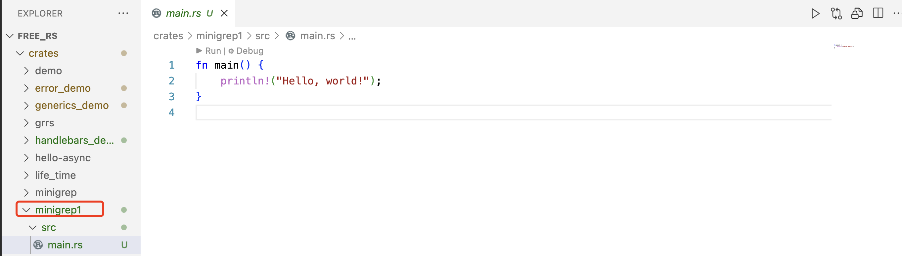

# Rust学习之实现命令行小工具minigrep（一）

通过开发一个在指定文件中查询某个特定字符串命的令行小工具进一步学习和巩固Rust基础。

源码已上传[Github](https://github.com/BruceZhang54110/free_rs/tree/main/crates/minigrep1)

## 创建项目

```bash
cargo new minigrep1
```




## 接收命令行参数

我们想要实现的命令效果如下：

```bash
cargo run -- searchstring example-filename.txt
```

第一个参数是 `searchstring`，是我们要搜索的字符串，第二个参数`example-filename.txt` ，是指定的文件，意思是在这个文件中搜索指定的字符串。

### 标准库中提供了处理命令行参数的库

我们使用标准库 `std::env` 来接收命令行参数

```rust
use std::env;

fn main() {
    let args: Vec<String> = env::args().collect();
    dbg!(args); // 打印参数
}

```

通过调用**标准库**中的`agrs()` 函数，我们就能获得命令行的参数，这个函数返回一个`Iterator`，可以用来遍历获取到的参数。再调用`collect()` 方法返回一个`String 的 动态数组Vector`。

`dbg!` 是 Rust 中的一个宏，用于调试。它会打印出表达式的值以及该表达式所在的文件和行号。在你的代码中，它会打印出变量`args`的值。这对于调试非常有用，因为它不仅显示了变量的值，还显示了它所在的文件和行号，帮助我们快速定位代码的位置。

执行`cargo run` 控制台打印如下：

```bash
    Finished `dev` profile [unoptimized + debuginfo] target(s) in 0.04s
     Running `/Users/xxxxx/myDevelop/rust_project/free_rs/target/debug/minigrep1`
[crates/minigrep1/src/main.rs:5:5] args = [
    "/Users/xxxxx/myDevelop/rust_project/free_rs/target/debug/minigrep1",
]
```

因为我们还没有在`cargo run` 后面追加参数，所以`dbg!(args);`只打印了执行代码本身的文件和行号。

我们再看看追加参数的效果，执行`cargo run -- needle haystack`，控制台打印如下：

```bash
     Running `/Users/xxxxx/myDevelop/rust_project/free_rs/target/debug/minigrep1 needle haystack`
[crates/minigrep1/src/main.rs:5:5] args = [
    "/Users/xxxxx/myDevelop/rust_project/free_rs/target/debug/minigrep1",
    "needle",
    "haystack",
]
```

### 打印传入的两个参数

我们使用两个变量接收传入的两个参数

```
use std::env;

fn main() {
    let args: Vec<String> = env::args().collect();
    // dbg!(args); // stderr
    // 传入两个参数
    let query = &args[1];
    let file_path = &args[2];

    println!("Searching for {}", query);
    println!("In file {}", file_path);
}
```

执行cargo run，控制台打印如下：

```
Searching for test
In file simple.txt
```

## 读取文件

我们在二进制项目目录下创建一个`poem.txt`，内容如下，我们将使用Rust 读取这个文件的内容来进行查找。

```
I'm nobody! Who are you?
Are you nobody, too?
Then there's a pair of us - don't tell!
They'd banish us, you know.

How dreary to be somebody!
How public, like a frog
To tell your name the livelong day
To an admiring bog!
```

我们使用标准库中的`fs::read_to_string` 读取文件，使用`expect` 处理异常，如果读取过程中出现了错误，那么`expect` 就会调用`panic!`宏，打印`expect`中的错误信息。

```
   // 读取文件 
    let contents = fs::read_to_string(file_path).expect("Something went wrong reading the file");
```

完整代码如下：

```rust
use std::{env, fs};

fn main() {
    let args: Vec<String> = env::args().collect();
    // dbg!(args); // stderr
    // 传入两个参数
    let query = &args[1];
    let file_path = &args[2];

    println!("Searching for {}", query);
    println!("In file {}", file_path);

    // 读取文件
    let contents = fs::read_to_string(file_path).expect("Something went wrong reading the file");
    println!("With text:\n{}", contents);
}

```

## 重构一下代码

#### 拆分代码

现在main方法中实现了所有的逻辑，承担了好几个功能。我可以优化一下，分离不同的功能，每个函数只负责一个任务。

我们拆分为 `main.rs` 和 `lib.rs` ，主要程序逻辑在lib.rs，命令解析比较简单可以放到main.rs中。

重构的好处：

1. 关注点分离，职责清晰
2. 便于测试，lib.rs 中的逻辑都可以测试
3. main.rs 保持简洁，易于验证正确性

将解析参数提取到一个函数当中：

```
fn parse_config(args: &Vec<String>) -> (&str, &str) {
    let query = &args[1];
    let file_path = &args[2];
    (query, file_path)
}
```

函数返回一个元组，里边是对String的引用，在Rust里边如果想返回对字符串的引用，**通常使用字符串切片也就是`&str`**，他的兼容性更好，如何是&String，那么一定是对字符串的引用，如果是&str，那么可以是对字符串的引用，也可以是对字符串字面量的引用。

#### 使用结构体来存放两个参数

返回的元组中两个参数都是相关的，我们定义为一个**`struct`** ，使用结构体来存放最终代码如下：

```

struct Config {
    query: String,
    file_path: String,
}

fn parse_config(args: &Vec<String>) -> Config {
    let query = args[1].clone();
    let file_path = args[2].clone();
    Config {
        query,
        file_path
    }
}

```

既然`parse_config` 是为了转换参数返回一个`Config`，根据Rust的惯例我们可以实现`Config`的关联函数`new()` ，这就**相当于是一个构造函数**，这样就不用parse_config函数了，代码如下：

```rust
use std::{env, fs};

fn main() {
    let args: Vec<String> = env::args().collect();
    // dbg!(args); // stderr
    // 传入两个参数

    let config = Config::new(&args);

    println!("Searching for {}", config.query);
    println!("In file {}", config.file_path);

    // 读取文件
    let contents = fs::read_to_string(config.file_path).expect("Something went wrong reading the file");
    println!("With text:\n{}", contents);
}

struct Config {
    query: String,
    file_path: String,
}

impl Config {
    fn new(args: &Vec<String>) -> Config {
        let query = args[1].clone();
        let file_path = args[2].clone();
        Config {
            query,
            file_path
        }
    }
}
```

#### 错误处理

使用数组接收参数是有可能发生错误的，比如执行命令没有传递参数。

直接执行  `cargo run`，会发生panic。

```bash
thread 'main' panicked at crates/minigrep1/src/main.rs:25:25:
index out of bounds: the len is 1 but the index is 1
```

我们可以改进这里的错误处理，可以提前判断参数数组长度，如果长度小于3，就主动`panic!`。

```
impl Config {
    fn new(args: &Vec<String>) -> Config {
        if args.len() < 3 {
            panic!("Not enough arguments");
        }
        let query = args[1].clone();
        let file_path = args[2].clone();
        Config {
            query,
            file_path
        }
    }
}
```

进一步改进，由于这里并不算系统异常，算是缺失参数的业务异常。所以可以使用`Result`进行处理，错误时可以返回`Err`，同时将`new` 改为`build` ，因为函数new往往不出现异常。

`unwrap_or_else` 如果前面Result 返回的是Ok，那么这个函数就会把Ok里的值提取出来，如果发生错误就会执行`unwrap_or_else` 方法块中的内容。

```
use std::{env, fs};
use std::process;

fn main() {
    let args: Vec<String> = env::args().collect();
    // dbg!(args); // stderr
    // 传入两个参数

    let config = Config::build(&args).unwrap_or_else(|err| {
        eprintln!("Problem parsing arguments: {}", err);
        process::exit(1);
    });

    println!("Searching for {}", config.query);
    println!("In file {}", config.file_path);

    // 读取文件
    let contents = fs::read_to_string(config.file_path).expect("Something went wrong reading the file");
    println!("With text:\n{}", contents);
}

struct Config {
    query: String,
    file_path: String,
}

impl Config {
    fn build(args: &Vec<String>) -> Result<Config, &'static str> {
        if args.len() < 3 {
            return Err("Not enouth arguments"); // 传入参数不够
        }
        let query = args[1].clone();
        let file_path = args[2].clone();

        Ok(Config {
            query,
            file_path
        })
    }
}

```


我们创建一个run函数，把读取文件的的逻辑提取到单独函数中来。

```
use std::error::Error;
use std::{env, fs};
use std::process;

fn main() {
    let args: Vec<String> = env::args().collect();
    // dbg!(args); // stderr
    // 传入两个参数

    let config = Config::build(&args).unwrap_or_else(|err| {
        eprintln!("Problem parsing arguments: {}", err);
        process::exit(1);
    });

    println!("Searching for {}", config.query);
    println!("In file {}", config.file_path);

    if let Err(e) = run(config) {
        eprintln!("Application error {}", e);
        process::exit(1)
    }
}

fn run(config: Config) -> Result<(), Box<dyn Error>> {
    // 读取文件
    let contents = fs::read_to_string(config.file_path)?;
    println!("With text:\n{}", contents);
    Ok(())
}
```

#### 分割main.rs

**main.rs**

```rust
use std::env;
use std::process;

use minigrep1::Config;


fn main() {
    let args: Vec<String> = env::args().collect();
    // dbg!(args); // stderr
    // 传入两个参数

    let config = Config::build(&args).unwrap_or_else(|err| {
        eprintln!("Problem parsing arguments: {}", err);
        process::exit(1);
    });

    println!("Searching for {}", config.query);
    println!("In file {}", config.file_path);

    if let Err(e) = minigrep1::run(config) {
        eprintln!("Application error {}", e);
        process::exit(1)
    }
}


```

lib.rs

```rust
use std::error::Error;

use std::fs;
pub fn run(config: Config) -> Result<(), Box<dyn Error>> {
    // 读取文件
    let contents = fs::read_to_string(config.file_path)?;
    println!("With text:\n{}", contents);
    Ok(())
}

pub struct Config {
    pub query: String,
    pub file_path: String,
}

impl Config {
    pub fn build(args: &Vec<String>) -> Result<Config, &'static str> {
        if args.len() < 3 {
            return Err("Not enouth arguments"); // 传入参数不够
        }
        let query = args[1].clone();
        let file_path = args[2].clone();

        Ok(Config {
            query,
            file_path
        })
    }
}
```

#### 开发search逻辑并使用单元测试

我们写一个`search`函数用于实现具体根据关键字查找文件内容的逻辑，这里用到了**生命周期标注语法**。

`search<'a>(query: &str, contents: &'a str) -> Vec<&'a str>`

search函数第一个参数`query`是一个引用别是要搜索的关键词，第二个参数是文本内容`contents`也是和引用。函数返回一个数组，数组中是一个引用。函数返回值是依赖文本内容`contents` 的，所以这里要使用生命周期标注，标注出返回值的生命周期和参数中`contents` 是一致的。

**生命周期标注知识点可以查看其他文章**：[跳转](https://bruce54110.github.io/free-blog/rust/lifetime/rust-lifetime.html#%E6%96%B9%E6%B3%95%E5%AE%9A%E4%B9%89%E4%B8%AD%E7%9A%84%E7%94%9F%E5%91%BD%E5%91%A8%E6%9C%9F%E6%A0%87%E6%B3%A8)

```rust

pub fn search<'a>(query: &str, contents: &'a str) -> Vec<&'a str> {
    let mut result = Vec::new();
    for line in contents.lines() {
        if line.contains(query) {
            result.push(line);
        }
    }
    result
}

#[cfg(test)]
mod tests {
    use std::vec;

    use super::*;

    #[test]
    fn one_test() {
        let query = "duct";
        let contents = "\
Rsut:
safe, fast, productive.
Pick three.";
        assert_eq!(vec!["safe, fast, productive."], search(query, contents))

    }
 }
```

search函数中，` contents.lines()` 返回一个迭代器，把每一行挨个返回。循环判断是否包含查询关键字。

我们执行 `one_test` 测试，query参数是`duct` ，预期结果是`safe, fast, productive.` 测试通过。

```
cargo test
```

```

running 0 tests

test result: ok. 0 passed; 0 failed; 0 ignored; 0 measured; 0 filtered out; finished in 0.00s

   Doc-tests minigrep1

running 0 tests

test result: ok. 0 passed; 0 failed; 0 ignored; 0 measured; 0 filtered out; finished in 0.00s
```

`run` 函数当中调用`search` 打印输出找到的行信息

```rust
pub fn run(config: Config) -> Result<(), Box<dyn Error>> {
    // 读取文件
    let contents = fs::read_to_string(config.file_path)?;
    for line in search(&config.query, &contents) {
        println!("{}", line);
    }
    Ok(())
}
```

执行命令`cargo run -- public poem.txt`，结果如下，匹配中了一行。

```
Searching for public
How public, like a frog
```

增加大小写匹配的控制

```rust
pub fn search_case_insensitive<'a>(query: &str, contents: &'a str) -> Vec<&'a str> {
    let mut result = Vec::new();
    let query = query.to_lowercase();
    for line in contents.lines() {
        if line.to_lowercase().contains(&query) {
            result.push(line);
        }
    }
    result
}


#[cfg(test)]
mod tests {
    use std::vec;

    use super::*;

    #[test]
    fn one_test() {
        let query = "duct";
        let contents = "\
Rsut:
safe, fast, productive.
Pick three.";
        assert_eq!(vec!["safe, fast, productive."], search(query, contents))

    }

    #[test]
    fn case_sensitive() {
        let query = "duct";
        let contents = "\
Rsut:
safe, fast, productive.
Pick three.";
        assert_eq!(vec!["safe, fast, productive."], search(query, contents))

    }


    /// 大小写不敏感
    #[test]
    fn case_insensitive() {
        let query = "rUsT";
        let contents = "\
Rust:
safe, fast, productive.
Pick three.
Trust me.";
        assert_eq!(vec!["Rust:", "Trust me."], search_case_insensitive(query, contents))

    }

 }
```

#### 添加大小写判断逻辑

我们可以将大小写是否敏感当作一个配置，在Config 结构体中新增 `ignore_case` 属性。再使用环境变量来对ignore_case 赋值，这样就可以根据环境变量配置控制搜索关键词是否大小写敏感了。

```rust

pub struct Config {
    pub query: String,
    pub file_path: String,
    pub ignore_case: bool,
}

impl Config {
    pub fn build(args: &Vec<String>) -> Result<Config, &'static str> {
        if args.len() < 3 {
            return Err("Not enouth arguments"); // 传入参数不够
        }
        let query = args[1].clone();
        let file_path = args[2].clone();
        let ignore_case = env::var("IGNORE_CASE").is_ok();

        Ok(Config {
            query,
            file_path,
            ignore_case
        })
    }
}
```

没有设置环境变量执行 `cargo run -- to poem.txt`，搜索到两行。

```
Are you nobody, too?
How dreary to be somebody!
```

我本地环境是MacBook，设置环境变量命令是`export IGNORE_CASE=1`，然后再执行`cargo run -- to poem.txt`,返回结果包含了`To`。

```
Are you nobody, too?
How dreary to be somebody!
To tell your name the livelong day
To an admiring bog!
```

## 未完待续

后面继续优化


 

​	