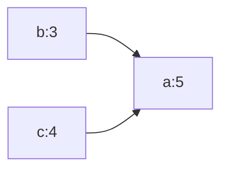
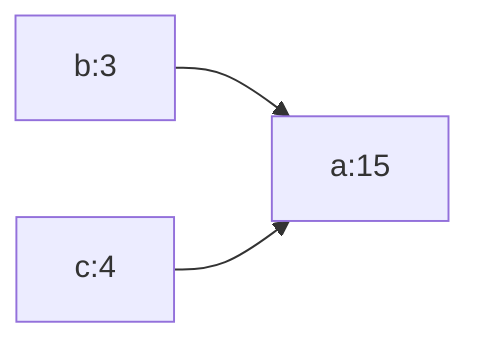

# Rust入门之智能指针
[本文源码](https://github.com/BruceZhang54110/free_rs/tree/main/crates/smart_pointers_demo)
## 什么是智能指针？

**指针**是一个包含内存地址的变量的通用概念。Rust中最常见的指针就是引用，使用`&` 作为标识，如`&a`，我们知道这是一个引用，指向a变量所表示的值。Rust中创建一个引用的行为称为 **借用**（*borrowing*）。

那么智能指针又是什么呢？**智能指针**（*smart pointers*）是一类数据结构，它们的表现类似指针，但是也拥有额外的元数据和功能。智能指针的概念起源于C++，在C++中**智能指针**主要用于管理在堆上分配的内存，它将普通的指针封装为一个栈对象。当栈对象的生存周期结束后，会在析构函数中释放掉申请的内存，从而防止内存泄漏。

在Rust中，智能指针也具备同样的功能，通过智能指针可以指向堆上的数据或者可以为某个变量分配多个所有者实现共享数据。

因为引用和借用，普通引用和智能指针的一个额外的区别是引用是一类只借用数据的指针；相反，在大部分情况下，智能指针 **拥有** 它们指向的数据。下面我们介绍Rust 标准库当中的几种智能指针。

## 使用`Box<T>`指向堆上的数据

`Box<T> ` 允许将数据存储到Heap上（而不是Stack），留在Stack上的只是指向Heap数据的引用。

特点：

- 除了在Heap上而不是Stack上存储数据外，没有性能开销
- 没有太多额外性能

使用`Box<T>` 的场景：

- 在需要知道确切大小的上下文中，却使用一个编译时无法确定大小的类型
- 有大量数据，想要转移所有权，但需确保在转移时数据不会发生复制
- 当你想要拥有一个值，且你只关心它是否实现了某个trait，而不是具体的类型

代码示例：

```rust
fn main() {
    let b: Box<i32> = Box::new(5);
    println!("b = {}", b);
}

```

使用 `Box::new` 方法就创建了一个`Box<T>` 类型，泛型中的值就存放到了Heap中。我们可以打印变量`b`，当代码执行结束走出作用域时，在Heap中的`5`，和在Stack上的Box引用都会被销毁。


使用Box<T> 实现递归链表结构的例子：

```
enum List {
    Cons(i32, List),
    Nil,
}

#[cfg(test)]
mod tests {

    use super::*;
    use List::*;


    #[test]
    fn test_box() {
        let list = Cons(1, Cons(2, Cons(3, Nil)));
    }

}
```

执行报错：

```bash
error[E0072]: recursive type `List` has infinite size
 --> crates/smart_pointers_demo/src/lib.rs:1:1
  |
1 | enum List {
  | ^^^^^^^^^
2 |     Cons(i32, List),
  |               ---- recursive without indirection
  |
help: insert some indirection (e.g., a `Box`, `Rc`, or `&`) to break the cycle
  |
2 |     Cons(i32, Box<List>),
  |               ++++    +

```

Rust 编译器在编译时需要确定所有类型的固定大小，但递归类型（如链表、树）会无限嵌套，导致编译器无法计算其大小。直接定义递归类型（如 `Cons(i32, List)`）会触发此错误。

**解决方案**：
使用 `Box<T>` 将递归成员包裹起来，将数据存储在堆上，而非栈上。`Box` 是一个固定大小的指针（通常为 8 字节），能明确告知编译器类型大小，从而解决无限大小问题。

**修复后的代码：**

```rust
enum List {
    Cons(i32, Box<List>),
    Nil,
}

#[cfg(test)]
mod tests {

    use super::*;
    use List::*;


    #[test]
    fn test_box() {
        let list = Cons(1, Box::new(Cons(2, Box::new(Cons(3, Box::new(Nil))))));
    }

}
```

## Deref Trait

通过Deref Trait 处理智能指针，让它可以像普通引用一样。

- Deref Trait 允许自定义解引用运算符`*`的行为
- 通过适当实现Deref Trait，可以让智能指针像普通引用来使用
- 我们编写的用于引用的代码，也能用于智能指针

普通的**解引用**代码示例如下：

```rust
    #[test]
    fn test_box3() {
        let x = 5;
        let y = &x;

        assert_eq!(5, x);
        assert_eq!(5, *y);
    }
```

使用 `Box<T>` 智能指针代码示例如下：

```rust
    #[test]
    fn test_box3() {
        let x = 5;
        let y = Box::new(x);

        assert_eq!(5, x);
        assert_eq!(5, *y);
    }
```

智能指针的解引用写法和普通引用的解引用写法是一样的。

我们实现一下自己的`MyBox<T>` 来看看什么效果。

```rust
struct MyBox<T>(T);

impl<T> MyBox<T> {
    fn new(x: T) -> MyBox<T> {
        MyBox(x)
    }
}
```

```rust
    #[test]
    fn test_box4() {
        let x = 5;
        let y = MyBox::new(x);

        assert_eq!(5, x);
        assert_eq!(5, *y);

    }
```

**编译报错：**无法解引用

```bash
error[E0614]: type `MyBox<{integer}>` cannot be dereferenced
  --> crates/smart_pointers_demo/src/lib.rs:52:23
   |
52 |         assert_eq!(5, *y);
   |                       ^^
```


这时候 Deref  Trait 就排上用场了，只有实现了 Deref  Trait ，我们自定义的`MyBox<T>` 才能正常解引用。实现`Deref` 之后就可以编译通过正常执行了。

```rust
impl<T> Deref for MyBox<T> {
    type Target = T; // 关联类型

    fn deref(&self) -> &Self::Target { // 返回self这个不可变引用的目标引用
        &self.0 // .0 取结构体的第一个元素
    }
}
```

### Deref coercion 隐式解引用转换

- 隐式解引用转换能将实现了 Deref trait 的类型的引用转换为另一个类型的引用

​		例如：由于String 实现了 返回 &str 的Deref trait，所以可以将&String 转换为 &str

- 编写函数和方法调用时，不需要添加太多显式的`&` 和 `*`

- 允许编写能同时适用于引用或智能指针的代码

```rust
fn hello(name: &str) {
    println!("Hello, {}!", name);
}
```

```rust
    #[test]
    fn test_box5() {
        let m = MyBox::new(String::from("Rust"));
        hello(&m);
    }
```

执行单元测试代码，`hello(&m)` 成功打印，现在分析一下：

1. `m` 是 `MyBox` `&m` 就是对`MyBox` 的引用
2. 由于`MyBox` 实现了 `Deref` trait，所以Rust 将对MyBox的引用转成了对`MyBox`中`String`的引用

3. Rust标准库对String也实现了`Deref` trait，可以将&String 转换为 &str

```rust
&MyBox<String> --> &String --> &str
```

所以hello方法这里要求的参数`&str`，我们可以把`&m` 传进去。

### Deref 强制转换如何与可变性交互

类似于如何使用 `Deref` trait 重载不可变引用的 `*` 运算符，Rust 提供了 `DerefMut` trait 用于重载可变引用的 `*` 运算符。

Rust 在发现类型和 trait 实现满足三种情况时会进行 Deref 强制转换：

- 当 `T: Deref<Target=U>` 时从 `&T` 到 `&U`。
- 当 `T: DerefMut<Target=U>` 时从 `&mut T` 到 `&mut U`。
- 当 `T: Deref<Target=U>` 时从 `&mut T` 到 `&U`。

头两个情况除了第二种实现了可变性之外是相同的：第一种情况表明如果有一个 `&T`，而 `T` 实现了返回 `U` 类型的 `Deref`，则可以直接得到 `&U`。第二种情况表明对于可变引用也有着相同的行为。

第三个情况有些微妙：Rust 也会将可变引用强转为不可变引用。但是反之是 **不可能** 的：不可变引用永远也不能强转为可变引用。因为根据借用规则，如果有一个可变引用，其必须是这些数据的唯一引用（否则程序将无法编译）。将一个可变引用转换为不可变引用永远也不会打破借用规则。将不可变引用转换为可变引用则需要初始的不可变引用是数据唯一的不可变引用，而借用规则无法保证这一点。因此，Rust 无法假设将不可变引用转换为可变引用是可能的。

## Drop Trait

用于定义一个值即将超出作用域时的清理行为

- 实现智能指针时几乎总是会用到Drop Trait的功能
- Rust编译器会自动插入Drop 实现中的代码，避免资源泄漏
- Drop Trait 只要求实现drop 方法，参数是对self的可变引用
- Drop Trait 在prelude中，无需手动导入

代码示例：

```rust
struct ConsumerSmartPointer {
    data: String,
}

impl Drop for ConsumerSmartPointer {

    fn drop(&mut self) {
        println!("Dropping ConsumerSmartPointer with data `{}`!", self.data);
    }

}
```

```rust
    #[test]
    fn test_drop() {
        let c = ConsumerSmartPointer {
            data: String::from("some data"),
        };
        let d = ConsumerSmartPointer {
            data: String::from("other data"),
        };
        println!("ConsumerSmartPointer created.");

    }
```

单元测试控制台输出：

```bash
running 1 test
test tests::test_drop ... ok

successes:

---- tests::test_drop stdout ----
ConsumerSmartPointer created.
Dropping ConsumerSmartPointer with data `other data`!
Dropping ConsumerSmartPointer with data `some data`!


successes:
    tests::test_drop
```

我们可以看到先打印了`ConsumerSmartPointer created.` 再分别对两个变量进行了drop释放，而且是后创建的先释放。

### 通过 `std::mem::drop` 提早丢弃值

- Rust是不允许手动调用Drop Trait方法
- 如果你想在值的作用域结束前提前丢弃它，那么久必须使用标准库中提供的`std::mem::drop`函数
- `std::mem::drop`函数不会干扰Rust的自动清理机制
  - 因为它通过接管值的所有权，并在调用后销毁它，避免了双重释放问题。

## 引用计数智能指针`Rc<T> `

- 有些情况下，一个值是可能拥有多个所有者的
- `Rc<T>` 可以开启“多重所有权”
- 跟踪一个值的引用数量，可判断该值是否还在使用，如果没有引用了，就迅速清理掉了

**使用场景**：

- 想在Heap上分配一些数据，供程序的多个部分读取，但在编译时无法确定哪个部分会最后完成对数据的使用

- 只能用于单线程场景

代码示例：

```rust
enum List {
    Cons(i32, Box<List>),
    Nil,
}
```

```rust
    #[test]
    fn test_rc1() {
        let a = Cons(5, Box::new(Cons(10, Box::new(Nil))));
        let b = Cons(3, Box::new(a));
        let c = Cons(4, Box::new(a));
    }
```

执行单元测试发生报错：

```bash
    |
101 |         let a = Cons(5, Box::new(Cons(10, Box::new(Nil))));
    |             - move occurs because `a` has type `List`, which does not implement the `Copy` trait
102 |         let b = Cons(3, Box::new(a));
    |                                  - value moved here
103 |         let c = Cons(4, Box::new(a));
    |                                  ^ value used here after move
```

```rust
enum ListRc {
    ConsRc(i32, Rc<ListRc>),
    NilRc,
}
```

```rust
    #[test]
    fn test_rc2() {
        let a = Rc::new(ConsRc(5, Rc::new(ListRc::ConsRc(10, Rc::new(NilRc)))));
        println!("a has {} strong references", Rc::strong_count(&a));
        let b = Rc::new(ConsRc(3, Rc::clone(&a)));
        {
            let c = Rc::new(ConsRc(4, Rc::clone(&a)));
            println!("a has {} strong references", Rc::strong_count(&a));

        }
        println!("a has {} strong references", Rc::strong_count(&a));
    }
```

使用 `Rc::strong_count` 可以获取引用的数量，执行结果如下：

```bash

---- tests::test_rc2 stdout ----
a has 1 strong references
a has 3 strong references
a has 2 strong references


successes:
    tests::test_rc2
```

创建完`a`变量之后，打印的引用数是1，然后每次调用`Rc::clone` 都会增加1，当走出作用域时，计数就会减1。

## 测试题

再看下面这个代码，单元测试打印结果会是什么呢？

```rust
struct Example;

impl Drop for Example {
    fn drop(&mut self) {
        println!("drop");
    }

}

#[cfg(test)]
mod tests {
    use std::rc::Rc;

    use super::Example;
    
    #[test]
    fn test1() {
        let x = Rc::new(Example);
        let y = Rc::clone(&x);
        println!("A");
        drop(x);
        println!("B");
        drop(y);
        println!("C");
    }

}
```

```bash

---- rc_code::tests::test1 stdout ----
A
B
drop
C


successes:
    rc_code::tests::test1
```

原因：

- `let x = Rc::new(Example);` → 引用计数 = 1。
- `let y = Rc::clone(&x);` → 引用计数 = 2。
- `drop(x);` → 引用计数 = 1（`Example` 未释放）。
- `drop(y);` → 引用计数 = 0 → 触发 `Example` 的 `drop` 方法，输出 "drop"。

## `RefCell<T>` 和内部可变性模式

**内部可变性**（*Interior mutability*）是 Rust 中的一个设计模式，它允许你即使在有不可变引用时也可以改变数据，这通常是借用规则所不允许的。为了改变数据，该模式在数据结构中使用 `unsafe` 代码来模糊 Rust 通常的可变性和借用规则。不安全代码表明我们在手动检查这些规则而不是让编译器替我们检查。

当可以确保代码在运行时会遵守借用规则，即使编译器不能保证的情况，可以选择使用那些运用内部可变性模式的类型。所涉及的 `unsafe` 代码将被封装进安全的 API 中，而外部类型仍然是不可变的。

### 遵循内部可变性模式的 `RefCell<T>` 类型

在运行时通过`RefCall<T>` 强制执行借用规则

`RefCall<T>` 类型表示对其所持有的数据的单一所有权

**回顾借用规则：**

- 在任何时候，要么拥有一个可变引用，要么任意数量的不可变引用
- 引用必须始终有效

**比较一下 `RefCell<T>` 和  `Box<T>`：**

对于引用和 `Box<T>`，借用规则的不可变性作用于编译时。对于 `RefCell<T>`，这些不可变性作用于 **运行时**。对于引用，如果违反这些规则，会得到一个编译错误。而对于 `RefCell<T>`，如果违反这些规则程序会 panic 并退出。

### `RefCell<T>`何时使用

正是用于当你确信代码遵守借用规则，而编译器不能理解和确定的时候。

- Rust编译器是保守的
- `RefCell<T>` 只能用于单线程场景

|                | `Box<T>`     | `Rc<T>`    | `RefCell<T>` |
| -------------- | ------------ | ---------- | ------------ |
| 所有权         | 单一所有者   | 多个所有者 | 单一所有者   |
| 借用检查时机   | 编译时       | 编译时     | 运行时       |
| 允许的借用类型 | 可变、不可变 | 不可能     | 可变、不可变 |
| 内部可变性     | 不支持       | 不支持     | 支持         |
| 线程安全       | 看情况       | 仅单线程   | 仅单线程     |

代码示例：

```
    #[test]
    fn test1() {
        let x = 5;
        let y = &mut x;
    }
```

这段代码将不可变变量x变成可变变量，编译会报错：

error[E0596]: cannot borrow `x` as mutable, as it is not declared as mutable

但是有时候有些场景，需要这样做，利用内部可变性。

### 内部可变性的用例：mock 对象

时在测试中程序员会用某个类型替换另一个类型，以便观察特定的行为并断言它是被正确实现的。这个占位符类型被称为 **测试替身**(*test double*)。就像电影制作中的替身演员 (*stunt double*) 一样，替代演员完成高难度的场景。测试替身在运行测试时替代某个类型。**mock 对象** 是特定类型的测试替身，它们记录测试过程中发生了什么以便可以断言操作是正确的。

虽然 Rust 中的对象与其他语言中的对象并不是一回事，Rust 也没有像其他语言那样在标准库中内建 mock 对象功能，不过我们确实可以创建一个与 mock 对象有着相同功能的结构体。

如下是一个我们想要测试的场景：我们在编写一个记录某个值与最大值的差距的库，并根据当前值与最大值的差距来发送消息。例如，这个库可以用于记录用户所允许的 API 调用数量限额。

该库只提供记录与最大值的差距，以及何种情况发送什么消息的功能。使用此库的程序则期望提供实际发送消息的机制：程序可以选择记录一条消息、发送 email、发送短信等等。库本身无需知道这些细节；只需实现其提供的 `Messenger` trait 即可。

```rust
pub trait Messenger {
    fn send(&self, msg: &str);
}

pub struct LimitTracker<'a, T: Messenger> {
    messenger: &'a T,
    value: usize,
    max: usize,
}

impl<'a, T> LimitTracker<'a, T>
where
    T: Messenger,
{
    pub fn new(messenger: &'a T, max: usize) -> LimitTracker<'a, T> {
        LimitTracker {
            messenger,
            value: 0,
            max,
        }
    }

    pub fn set_value(&mut self, value: usize) {
        self.value = value;

        let percentage_of_max = self.value as f64 / self.max as f64;

        if percentage_of_max >= 1.0 {
            self.messenger.send("Error: You are over your quota!");
        } else if percentage_of_max >= 0.9 {
            self.messenger
                .send("Urgent warning: You've used up over 90% of your quota!");
        } else if percentage_of_max >= 0.75 {
            self.messenger
                .send("Warning: You've used up over 75% of your quota!");
        }
    }
}


/// 测试代码
#[cfg(test)]
mod tests {
    use super::*;

    struct MockMessenger {
        sent_messages: Vec<String>,
    }

    impl MockMessenger {
        fn new() -> MockMessenger {
            MockMessenger {
                sent_messages: vec![],
            }
        }
    }

    impl Messenger for MockMessenger {
        fn send(&self, message: &str) {
            self.sent_messages.push(String::from(message));
        }
    }

    #[test]
    fn it_sends_an_over_75_percent_warning_message() {
        let mock_messenger = MockMessenger::new();
        let mut limit_tracker = LimitTracker::new(&mock_messenger, 100);

        limit_tracker.set_value(80);

        assert_eq!(mock_messenger.sent_messages.len(), 1);
    }
}
```

编写测试代码，创建`MockMessenger struct` 其中有一个 `sent_messages` 集合。因为是测试，我们为实现`MockMessenger` 实现`Messenger trait`  时不会真的发送消息，而是放到 `sent_messages` 集合当中。

这时，编译就报错了：

```
cannot borrow `self.sent_messages` as mutable, as it is behind a `&` reference
`self` is a `&` reference, so the data it refers to cannot be borrowed as mutable
```

**错误发生位置：**

```rust
impl Messenger for MockMessenger {
    fn send(&self, message: &str) {  // 这里是&self（不可变引用）
        self.sent_messages.push(String::from(message));  // ❌ 尝试修改不可变引用的字段
    }
}
```

**错误分析：**

1. **`&self`的含义**
   `&self`表示方法接收**不可变引用**，意味着：
   - 不能修改结构体的任何字段（包括`sent_messages`）
   - 编译器会阻止任何可能改变状态的操作
2. **`push`操作的需求**
   `Vec::push`需要**可变访问**（`&mut self`），因为它会修改数组的内容。当`self`是不可变引用时，`self.sent_messages`也是不可变的，导致矛盾。
3. **测试逻辑的矛盾**
   测试需要通过`MockMessenger`收集发送的消息，但当前设计中：
   - `MockMessenger`通过不可变引用调用`send`
   - 却试图在不可变上下文中修改`sent_messages`

**使用Refcell<T> 修复：**

如果这个`Messenger Trait` 是外部的库，那我们就无法通过修改为可变变量来修复这个问题了。这时候就要利用内部可变性了。 我们将通过 `RefCell` 来储存 `sent_messages`，然后 `send` 将能够修改 `sent_messages` 并储存消息。

修改测试代码如下：

```rust

#[cfg(test)]
mod tests {
    use super::*;
    use std::cell::RefCell;

    struct MockMessenger {
        sent_messages: RefCell<Vec<String>>,
    }

    impl MockMessenger {
        fn new() -> MockMessenger {
            MockMessenger {
                sent_messages: RefCell::new(vec![]),
            }
        }
    }

    impl Messenger for MockMessenger {
        fn send(&self, message: &str) {
            self.sent_messages.borrow_mut().push(String::from(message));
        }
    }

    #[test]
    fn it_sends_an_over_75_percent_warning_message() {
        let mock_messenger = MockMessenger::new();
        let mut limit_tracker = LimitTracker::new(&mock_messenger, 100);

        limit_tracker.set_value(80);
        assert_eq!(mock_messenger.sent_messages.borrow().len(), 1);
    }
}
```

现在 `sent_messages` 字段的类型是 `RefCell<Vec<String>>` 而不是 `Vec<String>`。在 `new` 函数中新建了一个 `RefCell<Vec<String>>` 实例替代空 vector。

对于 `send` 方法的实现，第一个参数仍为 `self` 的不可变借用，这是符合方法定义的。我们调用 `self.sent_messages` 中 `RefCell` 的 `borrow_mut` 方法来获取 `RefCell` 中值的可变引用，这是一个 vector。接着可以对 vector 的可变引用调用 `push` 以便记录测试过程中看到的消息。

最后在断言中，为了看到其内部 vector 中有多少个项，需要调用 `RefCell` 的 `borrow` 以获取 vector 的不可变引用。

### `RefCell` 在运行时记录借用

当创建不可变和可变引用时，我们分别使用 `&` 和 `&mut` 语法。对于 `RefCell<T>` 来说，则是 `borrow` 和 `borrow_mut` 方法，这属于 `RefCell<T>` 安全 API 的一部分。`borrow` 方法返回 `Ref<T>` 类型的智能指针，`borrow_mut` 方法返回 `RefMut<T>` 类型的智能指针。这两个类型都实现了 `Deref`，所以可以当作常规引用对待。

`RefCell<T>` 记录当前有多少个活动的 `Ref<T>` 和 `RefMut<T>` 智能指针。每次调用 `borrow`，`RefCell<T>` 将活动的不可变借用计数加一。当 `Ref<T>` 值离开作用域时，不可变借用计数减一。就像编译时借用规则一样，`RefCell<T>` 在任何时候只允许有多个不可变借用或一个可变借用。

#### 1. 借用计数模型

- 不可变借用（`borrow()`）
  - 调用时检查：当前是否有活跃的**可变借用**（`RefMut<T>`）。
  - 若有，panic（类似编译时「不能同时存在可变引用和不可变引用」）。
  - 若无，增加**不可变借用计数**，返回 `Ref<T>`（实现 `Deref`，等效 `&T`）。
- 可变借用（`borrow_mut()`）
  - 调用时检查：当前是否有活跃的**不可变借用**或**可变借用**。
  - 若有，panic（类似编译时「只能有一个可变引用」）。
  - 若无，设置**可变借用标记**，返回 `RefMut<T>`（实现 `DerefMut`，等效 `&mut T`）。

#### 2. 与编译时借用的对比

| 特性           | 编译时借用（`&`/`&mut`） | `RefCell<T>`（运行时借用）        |
| -------------- | ------------------------ | --------------------------------- |
| 借用检查时机   | 编译期                   | 运行期（`borrow`/`borrow_mut`时） |
| 不可变借用数量 | 多个                     | 多个（但无活跃可变借用时）        |
| 可变借用数量   | 单个                     | 单个                              |
| 安全性         | 编译期保证安全           | 可能 panic（需人为避免误用）      |

如果我们尝试违反这些规则，相比引用时的编译时错误，`RefCell<T>` 的实现会在运行时出现 panic。示例代码如下：

```rust
impl Messenger for MockMessenger {
        fn send(&self, message: &str) {
            let mut one_borrow = self.sent_messages.borrow_mut();
            let mut two_borrow = self.sent_messages.borrow_mut();

            one_borrow.push(String::from(message));
            two_borrow.push(String::from(message));
        }
}
```

发生panic：

```bash
already borrowed: BorrowMutError
stack backtrace:
   0: rust_begin_unwind
             at /rustc/f6e511eec7342f59a25f7c0534f1dbea00d01b14/library/std/src/panicking.rs:662:5
   1: core::panicking::panic_fmt
             at /rustc/f6e511eec7342f59a25f7c0534f1dbea00d01b14/library/core/src/panicking.rs:74:14
   2: core::cell::panic_already_borrowed
             at /rustc/f6e511eec7342f59a25f7c0534f1dbea00d01b14/library/core/src/cell.rs:789:5
   3: core::cell::RefCell<T>::borrow_mut
             at /rustc/f6e511eec7342f59a25f7c0534f1dbea00d01b14/library/core/src/cell.rs:1080:25
   4: <smart_pointers_demo::mess::tests::MockMessenger as smart_pointers_demo::mess::Messenger>::se
```

### 结合 `Rc` 和 `RefCell` 来拥有多个可变数据所有者

`RefCell<T>` 的一个常见用法是与 `Rc<T>` 结合。回忆一下 `Rc<T>` 允许对相同数据有多个所有者，不过只能提供数据的不可变访问。如果有一个储存了 `RefCell<T>` 的 `Rc<T>` 的话，就可以得到有多个所有者 **并且** 可以修改的值了

 `Rc<T>` 使得多个列表**共享**另一个列表的所有权。因为 `Rc<T>` **只存放不可变值**，所以一旦创建了这些列表值后就不能修改。让我们加入 `RefCell<T>` 来**获得修改列表中值**的能力。

还是用前面 `List Cons` 的例子，使用 `Rc<T>` 使得多个列表共享另一个列表的所有权， `Rc<T>` 只存放不可变值。在`Cons `中定义使用RefCell<T>，我们就允许修改所有列表中的值了。

**代码示例：**

```rust
use std::cell::RefCell;
use std::rc::Rc;

#[derive(Debug)]
enum List {
    Cons(Rc<RefCell<i32>>, Rc<List>),
    Nil,
}

#[cfg(test)]
mod tests {

    use super::*;
    use crate::refcell_list::List::{Cons, Nil};

    /// RefCell 搭配 Rc 实现对相同数据有用多个所有者，且可以对数据进行修改
    #[test]
    fn test1() {

        let value = Rc::new(RefCell::new(5));

        let a = Rc::new(Cons(Rc::clone(&value), Rc::new(Nil)));

        let b = Cons(Rc::new(RefCell::new(3)), Rc::clone(&a));

        let c = Cons(Rc::new(RefCell::new(4)), Rc::clone(&a));

        *value.borrow_mut() += 10;

        println!("a after = {:?}", a);
        println!("b  after= {:?}", b);
        println!("c  after= {:?}", c);

    }

}
```

执行单元测试结果：

```bash
successes:

---- refcell_list::tests::test1 stdout ----
a after = Cons(RefCell { value: 15 }, Nil)
b after= Cons(RefCell { value: 3 }, Cons(RefCell { value: 15 }, Nil))
c after= Cons(RefCell { value: 4 }, Cons(RefCell { value: 15 }, Nil))


successes:
    refcell_list::tests::test1

test result: ok. 1 passed; 0 failed; 0 ignored; 0 measured; 12 filtered out; finished in 0.00s
```

打印出a、b、c 都可以看到他们都拥有修改后的值15而不是5，b和c 都共同指向了a，a中的5+10 之后，b和c 指向的值都同步改为了15。






我们拥有了一个表面上不可变的List，不过可以使用`RefCell<T>` 中提供内部可变性的方法来在需要时修改数据。`RefCell<T>`的运行时借用检查规则也确实保护我们免于出现数据竞争，有时为了数据结构的灵活性是值得的。

注意`RefCell<T>` 不能用于多线程代码，`Mutex<T>` 是一个线程安全版本的`RefCell<T>` ，后续会在多线程部分讨论`Mutex<T>` 。

## 参考

1. https://zhuanlan.zhihu.com/p/14681763387
1. https://kaisery.github.io/trpl-zh-cn/ch15-05-interior-mutability.html