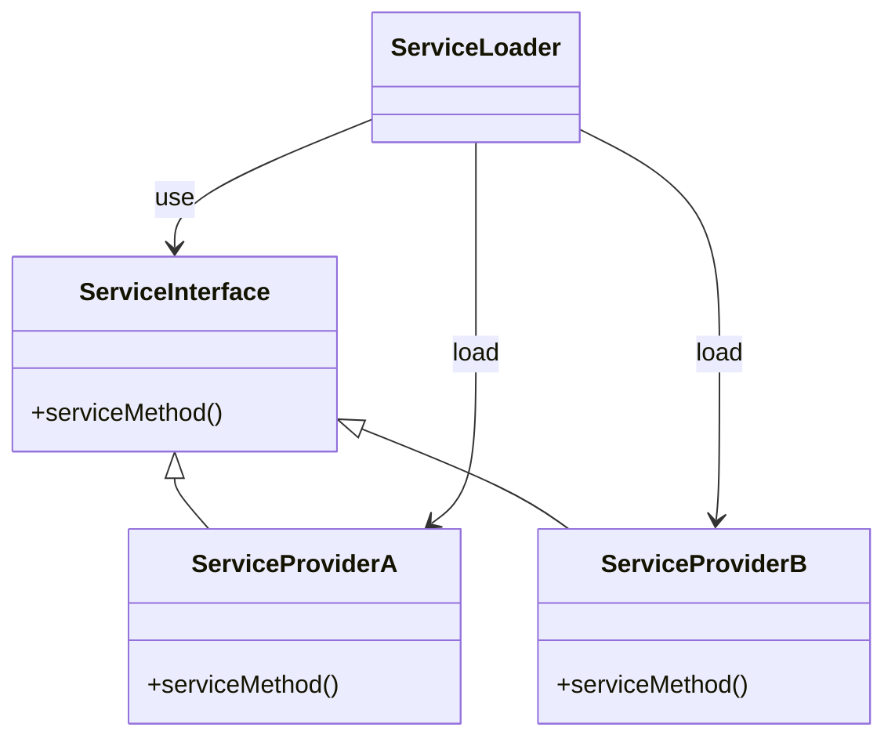
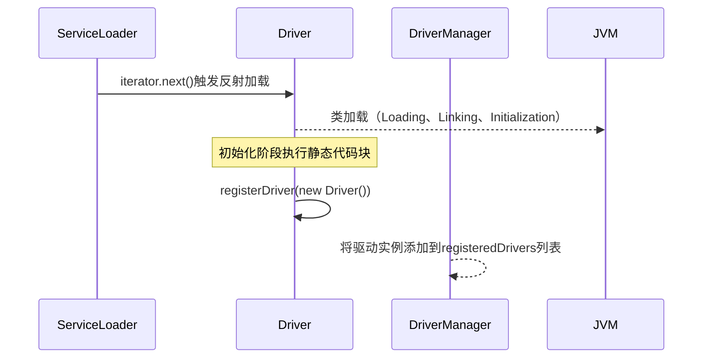
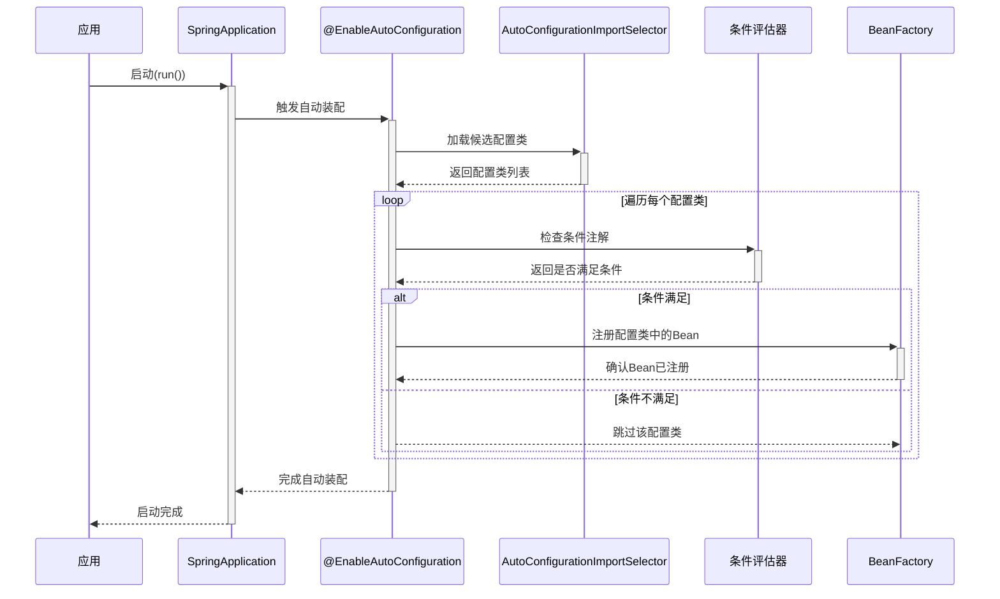

# 聊聊Java的SPI机制

### 什么是SPI呢？

SPI全称Service Provider Interface，翻译过来就是服务提供者接口。调用方提供接口声明，服务提供方对接口进行实现，提供服务的一种机制，服务提供方往往是第三方或者是外部扩展。

下面是一段`java.util.ServiceLoader` 类的注释：

> A service provider is a specific implementation of a service. The classes in a provider typically implement the interfaces and subclass the classes defined in the service itself. Service providers can be installed in an implementation of the Java platform in the form of extensions, that is, jar files placed into any of the usual extension directories. Providers can also be made available by adding them to the application's class path or by some other platform-specific means.

翻译：

服务提供者是对某一服务的具体实现。在服务提供者中的类一般会实现服务所定义的接口，并继承服务本身定义的类。服务提供者可以通过扩展的方式安装到Java平台的实现中，也就是说，将jar文件放置到标准的扩展目录之一。此外，服务提供者还可以通过将其添加到应用程序的类路径，或者使用其他与平台相关的手段来使其可用。

可以这样理解，Java提供了一种机制可以帮我们务发现加载某个接口的实现类，实现类不在本模块中，实现类可以由第三方提供，可以是依赖的jar或是其他扩展方式。

### SPI的好处是什么？

SPI机制使用了接口，自然有接口的特点，面相接口编程，提供制定标准，实现由是实现者提供。

1. **解耦和可扩展性：**SPI将接口与实现分离，我们就可以在不修改接口的情况下，轻松替换实现和新增新的实现，这也有利于模块化开发的扩展。
2. **标准化：**SPI提供了一种标准化的方式来定义和实现服务，这样不同的开发者可以遵循相同的规则来提供和消费服务，减少了集成时的混乱和错误。

### SPI原理

用一个示例画一个SPI原理图如下：



- `ServiceInterface` 是一个定义了服务方法的接口。
- `ServiceProviderA` 和 `ServiceProviderB` 是实现了 `ServiceInterface` 的具体服务提供者。
- `ServiceLoader` 负责加载服务并调用。

### Java SPI ServiceLoader工作流程

1. 首先在服务调用者中有一个功能接口`A`
   1. 第三方服务提供者作为插件模块要实现这个功能，首先有一个实现类`com.test.AImpl`实现这个接口，然后在自己的模块里的`META-INF/services/`目录下创建 `com.test.A文件，`，这里文件名是A接口的全限定名，文件内容就是`com.test.AImpl`，也就是实现类的全限定名。

2. 服务调用者使用ServiceLoader 创建加载器，根据接口精确遍历`META-INF/services/` 目录对对应接口的实现类进行反射并实例化，这样我们就可以获得的根据`A`接口的不同实现了。

### 接下来上示例代码

定义服务接口：

```java
package com.example.service;

/**
 * 定义演出接口
 */
public interface Perform {

    void show();
}
```

负责表演歌曲的服务提供者：

```java
package com.example.serviceprovider1;

public class Singer implements com.example.service.Perform {

    public void show() {
        System.out.println("表演歌曲节目");
    }
}
```

服务提供者所在jar中：

文件名：`META-INF/services/com.test.A`

内容：`com.example.serviceprovider1.Singer`

负责表演舞蹈的服务提供者：

```java
package com.example.serviceprovider;

import com.example.service.Perform;

/**
 * 舞者提供才艺目
 */
public class Dancer implements Perform {

    public void show() {
        System.out.println("表演跳舞节目");
    }

}

```

服务提供者所在jar中：

文件名：`META-INF/services/com.test.A`

内容：`com.example.serviceprovider.Dancer`

调用者：

```java
package com.example.serviceuser;

import com.example.service.Perform;

import java.util.Iterator;
import java.util.ServiceLoader;

public class MainTestSpi {
    public static void main(String[] args) {
        ServiceLoader<Perform> serviceLoader = ServiceLoader.load(Perform.class);
        Iterator<Perform> iterator = serviceLoader.iterator();
        while (iterator.hasNext()) {
            Perform perform = iterator.next();
            perform.show();
        }

    }
}

```

#### 调用结果：

```shell
表演跳舞节目
表演歌曲节目
```

### 不同框架的SPI思想实现之JDBC

我们先说JDBC中的SPI机制实现

1. JDK中`java.sql.Driver` 接口定义了定义了驱动与数据库交互的标准方法。
2. 不同的数据库厂商提供具体的驱动实现类，例如MySQL驱动实现了`Driver`接口的`connect()`方法，用于建立数据库连接。
3. 每个驱动JAR包的`META-INF/services`目录下需创建一个以接口全限定名（如`java.sql.Driver`）命名的文件，文件内容为实现类的全限定名（如`com.mysql.cj.jdbc.Driver`）。
4. ServiceLoader通过此文件发现并加载驱动。


这是Mysql JDBC通过SPI机制注册驱动的核心代码：

```
public class Driver extends NonRegisteringDriver implements java.sql.Driver {
    //
    // Register ourselves with the DriverManager
    //
    static {
        try {
            java.sql.DriverManager.registerDriver(new Driver());
        } catch (SQLException E) {
            throw new RuntimeException("Can't register driver!");
        }
    }

    /**
     * Construct a new driver and register it with DriverManager
     * 
     * @throws SQLException
     *             if a database error occurs.
     */
    public Driver() throws SQLException {
        // Required for Class.forName().newInstance()
    }
}
```

当`SerciceLoader的Iterator ` 调用`next()` 方法时，就会触发`java.sql.DriverManager.registerDriver(new Driver());` 对数据库厂商的驱动进行注册。

加载和注册驱动的过程如下：



### Spring Boot 自动装配也体现了SPI思想

##### 自动装配是 SPI 的“升级版”

- **隐式接口**：用注解和文件约定替代显式接口，降低侵入性。
- **动态加载**：通过条件注解实现按需装配，而非一次性加载所有实现类。
- **开箱即用**：通过 Starter 依赖传递，开发者只需关注业务逻辑，无需手动配置。

##### 自动装配流程

1. Spring Boot 通过 **`SpringFactoriesLoader`** 扫描所有依赖中的以下文件：

   - **旧方式**：`META-INF/spring.factories`（键为 `EnableAutoConfiguration`）。

   - **新方式**（Spring Boot 2.7+）：`META-INF/spring/org.springframework.boot.autoconfigure.AutoConfiguration.imports`。

```
# AutoConfiguration.imports
org.springframework.boot.autoconfigure.jdbc.DataSourceAutoConfiguration
org.springframework.boot.autoconfigure.web.servlet.DispatcherServletAutoConfiguration
...
```

2. 过滤和排序配置类

   - **去重与过滤**：排除重复的配置类，并根据 `@AutoConfigureOrder`、`@Order` 注解排序。

   - **排除不需要的配置**：通过 `spring.autoconfigure.exclude` 配置或 `@EnableAutoConfiguration(exclude=...)` 排除特定配置类。

3. 条件化评估（Conditional Evaluation）

Spring Boot 通过 **`@Conditional` 系列注解** 动态决定是否启用某个配置类或 Bean。常见的条件注解包括：

|            **注解**            |                **作用**                |
| :----------------------------: | :------------------------------------: |
|     `@ConditionalOnClass`      |       类路径中存在指定类时生效。       |
|  `@ConditionalOnMissingBean`   |     容器中不存在指定 Bean 时生效。     |
|    `@ConditionalOnProperty`    | 配置文件中存在指定属性且匹配值时生效。 |
| `@ConditionalOnWebApplication` |        应用是 Web 应用时生效。         |

**示例**：

java

```java
@AutoConfiguration
@ConditionalOnClass(DataSource.class) // 存在 DataSource 类时生效
public class DataSourceAutoConfiguration {
    @Bean
    @ConditionalOnMissingBean // 容器中没有 DataSource Bean 时生效
    public DataSource dataSource() {
        return new HikariDataSource();
    }
}
```

4. 加载并注册 Bean

通过条件评估的配置类中的 `@Bean` 方法会被执行，生成的 Bean 实例注册到 Spring 容器中。

5. 自动装配的优先级

   - **用户自定义 Bean 优先**：如果用户手动定义了某个 Bean（如 `@Bean` 方法），自动配置的 Bean 会被跳过（由 `@ConditionalOnMissingBean` 控制）。

   - **配置类加载顺序**：通过 `@AutoConfigureOrder` 或 `@Order` 控制配置类的执行顺序（值越小优先级越高）。

##### 自动装配的触发时机

自动装配在 Spring 容器的 **`refresh()`** 阶段完成，具体步骤如下：

1. **准备环境（Environment）**：加载配置文件（如 `application.properties`）。
2. **创建 `BeanFactory`**：初始化 Spring 容器的 Bean 工厂。
3. **执行 `BeanFactoryPostProcessor`**：处理 Bean 工厂的后期处理（如解析 `@Configuration` 类）。
4. **加载自动配置类**：通过 `AutoConfigurationImportSelector` 选择并加载符合条件的配置类。
5. **注册 Bean 定义**：将自动配置类中的 Bean 定义注册到容器。
6. **实例化单例 Bean**：完成所有 Bean 的初始化。

因此，Spring Boot 自动装配虽然没有传统意义上的接口，但通过**标准化约定和条件化注解**，更灵活地实现了 SPI 的核心思想：**解耦服务提供者与消费者，实现模块化扩展**。



Java 自身的SPI通过`ServiceLoader` 实现，使用起来简单，但是没有条件过滤，不便于按需加载。Spring Boot的自动装配，Dubbo的扫描扩展等其他框架都根据自身需求实现了更好用的SPI服务加载流程。

### SPI思想的应用场景

SPI（服务提供者接口）主要用于**解耦接口与实现，支持模块化，插件化扩展**。典型场景包括：

1. **框架扩展**：如JDBC驱动加载（Java SPI）、Dubbo的协议扩展（自适应SPI）。

2. **插件系统**：日志组件（Log4j2的`@Plugin`）。

3. **配置自动化**：Spring Boot Starter通过`AutoConfiguration.imports`实现“开箱即用”。

4. **服务治理**：微服务中动态加载服务发现（如Spring Cloud）、配置中心扩展。

5. **跨平台适配**：如SLF4J绑定不同日志实现，屏蔽底层差异。

   SPI通过**约定发现+动态加载**，提升系统灵活性和可维护性。

