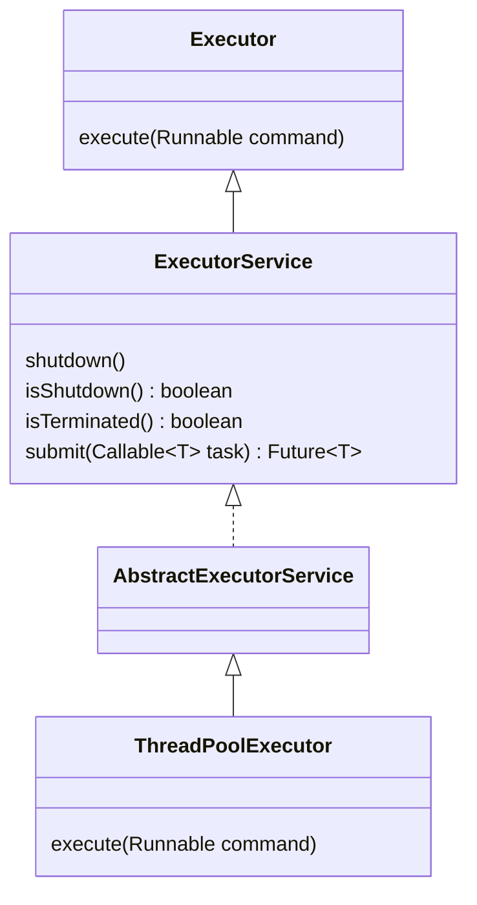

# Java线程池知识点梳理

## 什么是线程池？

线程在系统中创建的成本是相对比较高的，所以使用”池化“的思想，设计线程池，有大量任务需要执行时，可以直接从线程池中使用已经创建好的线程直接去执行。减少线程的创建和销毁带来的开销，线程池通过工作队列和线程管理来实现高效的任务执行。使用少量的线程数满足最大的吞吐量。

线程池的主要组成部分包括**工作线程、任务队列、线程管理器等**。线程池的设计有助于优化多线程程序的性能和资源利用，同时简化了线程的管理和复用的复杂性。

## 线程池的实现

Java线程池的核心实现类是ThreadPoolExecutor，主要类图如下：




### 线程池的状态

1. RUNNING： 线程池一旦被创建，就处于RUNNING状态，任务数为0，能够接收新任务，对已排队的任务进行处理。
2. SHUTDOWN：不接收新任务，但能处理已排队的任务。当调用线程池的shutdown()方法时，线程池会由RUNNING转变为SHUTDOWN状态。
3. STOP：不接收新任务，不处理已排队的任务，并且会中断正在处理的任务。当调用线程池的shutdownNow()方法时，线程池会由RUNNING或SHUTDOWN转变为STOP状态。
4. TIDYING：当线程池在SHUTDOWN状态下，任务队列为空且执行中任务为空，或者线程池在STOP状态下，线程池中执行中任务为空时，线程池会变为TIDYING状态，会执行terminated()方法。这个方法在线程池中是空实现，可以重写该方法进行相应的处理。
5. TERMINATED：线程池彻底终止。线程池在TIDYING状态执行完terminated()方法后，就会由TIDYING转变为TERMINATED状态。

#### 如何保存线程状态

**ThreadPoolExecutor** 源码中线程池的运行状态**使用 ctl 高3位保存运行状态，低29位保存有效的工作线程数**

```java
    private final AtomicInteger ctl = new AtomicInteger(ctlOf(RUNNING, 0));
    private static final int COUNT_BITS = Integer.SIZE - 3;
    private static final int CAPACITY   = (1 << COUNT_BITS) - 1;

    // runState is stored in the high-order bits
    private static final int RUNNING    = -1 << COUNT_BITS;
    private static final int SHUTDOWN   =  0 << COUNT_BITS;
    private static final int STOP       =  1 << COUNT_BITS;
    private static final int TIDYING    =  2 << COUNT_BITS;
    private static final int TERMINATED =  3 << COUNT_BITS;

    // Packing and unpacking ctl
    private static int runStateOf(int c)     { return c & ~CAPACITY; }
    private static int workerCountOf(int c)  { return c & CAPACITY; }
    private static int ctlOf(int rs, int wc) { return rs | wc; }
```

`COUNT_BITS`被定义为`Integer.SIZE - 3`，即32位整数的29位，每个线程池状态（如`RUNNING`、`SHUTDOWN`等）都是通过将一个整数**左移**`COUNT_BITS`位来定义的，这样就把状态值放到了整数的最高3位。

例如：

`RUNNING`状态的值为`-1`左移29位，`-1` 的二进制表示为`1111 1111 1111 1111 1111 1111 1111 1111`，共32个1。

-1 << 29 = `1110 0000 0000 0000 0000 0000 0000 0000`，其中高3位是`111`表示的就是线程池处于 RUNNING状态。

## 线程池核心参数

- corePoolSize：核心线程数，空闲了也不会销毁，除非设置了允许销毁核心线程（allowCoreThreadTimeOut）。
- maximumPoolSize：线程池允许的最大线程数
- keepAliveTime：当线程数大于核心线程数时，多余空闲的线程在这个时间内还没有等到新任务就会被销毁
- unit：keepAliveTime的时间单位
- workQueue：存放还未被线程执行的任务
- threadFactory：线程工厂，可以自定义设置线程池中线程的线程名称等
- handler：拒绝策略，但线程池无法执行新增的线程时，是抛弃还是其他策略。

```java
public ThreadPoolExecutor(int corePoolSize,
                              int maximumPoolSize,
                              long keepAliveTime,
                              TimeUnit unit,
                              BlockingQueue<Runnable> workQueue,
                              ThreadFactory threadFactory,
                              RejectedExecutionHandler handler) {
        if (corePoolSize < 0 ||
            maximumPoolSize <= 0 ||
            maximumPoolSize < corePoolSize ||
            keepAliveTime < 0)
            throw new IllegalArgumentException();
        if (workQueue == null || threadFactory == null || handler == null)
            throw new NullPointerException();
        this.acc = System.getSecurityManager() == null ?
                null :
                AccessController.getContext();
        this.corePoolSize = corePoolSize;
        this.maximumPoolSize = maximumPoolSize;
        this.workQueue = workQueue;
        this.keepAliveTime = unit.toNanos(keepAliveTime);
        this.threadFactory = threadFactory;
        this.handler = handler;
    }
```

## 线程池执行任务流程

1. 当工作线程数小于核心线程数时，新任务来临，会启动新线程执行任务。
2. 当工作线程数大于核心线程数且小于最大线程数时，新任务会保存到队列当中等待线程执行。
3. 当队列满了且核心线程数小于最大线程数时，新任务会创建新线程执行。
4. 当队列已满且工作线程数达到最大线程数时，线程池会触发拒绝策略由RejectedExecutionHandler处理。
5. 当线程池中线程数超过核心线程数，空闲时间超过keepAliveTime时，空闲线程会被销毁。

### 线程池拒绝策略

`RejectedExecutionHandler`：接口的实现类有四种，所以默认有四种拒绝策略：

`AbortPolicy`： 直接抛出异常，阻止系统正常运行。可以根据业务逻辑选择重试或者放弃提交等策略。

`CallerRunsPolicy`： 只要线程池未关闭，该策略直接在调用者线程中，运行当前被丢弃的任务。

不会造成任务丢失，同时减缓提交任务的速度，给执行任务缓冲时间。

`DiscardOldestPolicy`： 丢弃最老的一个请求，也就是即将被执行的任务，并尝试再次提交当前任务。

`DiscardPolicy`： 该策略默默地丢弃无法处理的任务，不予任何处理。如果允许任务丢失，这是最好的一种方案。


## Executors提供的几种线程池

- **newSingleThreadExecutor()**：只有一个线程的线程池，任务是顺序执行，适用于一个一个任务执行的场景
- **newCachedThreadPool()**：线程池里有很多线程需要同时执行，60s内复用，适用执行很多短期异步的小程序或者负载较轻的服务
- **newFixedThreadPool()**：拥有固定线程数的线程池，如果没有任务执行，那么线程会一直等待，适用执行长期的任务。
- **newScheduledThreadPool()**：用来调度即将执行的任务的线程池
- **newWorkStealingPool()**：底层采用forkjoin的Deque，采用独立的任务队列可以减少竞争同时加快任务处理


| 参数          | FixedThreadPool | CachedThreadPool  | ScheduledThreadPool | SingleThreadExecutor | SingleScheduledThreadPool |
| ------------- | :-------------: | :---------------: | :-----------------: | :------------------: | :-----------------------: |
| corePoolSize  |  构造函数传入   |         0         |    构造函数传入     |          1           |             1             |
| maxPoolSize   | 同corePoolSize  | Integer.MAX_VALUE |  Integer.MAX_VALUE  |          1           |     Integer.MAX_VALUE     |
| keepAliveTime |        0        |        60s        |          0          |          0           |             0             |

## 建议开发规范

阿里Java开发手册中提到，【强制】线程池不允许使用 Executors 去创建，而是通过 ThreadPoolExecutor 的方式，这样的处理方

式让写的同学更加明确线程池的运行规则，规避资源耗尽的风险。

Executors 返回的线程池对象的弊端如下：

1. FixedThreadPool 和 SingleThreadPool：允许的请求队列长度为 Integer.MAX_VALUE，可能会堆积大量的请求，从而导致 OOM。

2. CachedThreadPool：允许的创建线程数量为 Integer.MAX_VALUE，可能会创建大量的线程，从而导致 OOM。

3. ScheduledThreadPool：允许的请求队列长度为 Integer.MAX_VALUE，可能会堆积大量的请求，从而导致 OOM。

根据业务独立配置线程池，将较慢服务与主线程池隔离开。

创建线程池使用线程工厂指定形成名称，方便出错时排查。

线程资源必须由线程池提供，不允许自行在程序中显示创建线程。

# 参考

1. https://mp.weixin.qq.com/s/IVgGXQKU1QiT1ToN2wXHJg
2. https://mp.weixin.qq.com/s/icrrxEsbABBvEU0Gym7D5Q
3. https://tech.meituan.com/2020/04/02/java-pooling-pratice-in-meituan.html
