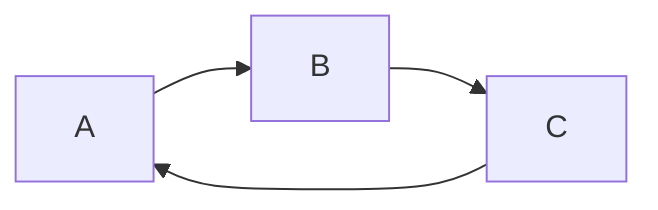
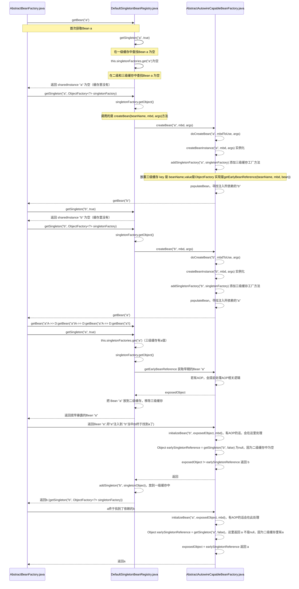

# 什么是循环依赖？

循环依赖就是循环引用，就是两个或多个bean相互之间的持有对方。比如CircleA引用CircleB，CircleB引用CircleC，CircleC引用CircleA。




# Spring如何解决循环依赖？

Spring容器循环依赖包括如下两种：

1. 构造器循环依赖
2. setter循环依赖

构造器循环依赖，表示通过构造器注入的循环依赖，此依赖是无法解决的，只能抛出`BeanCurrentlyInCreationException`异常。

原型模式下的依赖检查，只有单例模式下才会尝试解决循环依赖，原型模式下直接抛出异常`BeanCurrentlyInCreationException`异常。

**代码片段1**

```java
AbstractBeanFactory抽象类：

// Fail if we're already creating this bean instance:
// We're assumably within a circular reference.
if (isPrototypeCurrentlyInCreation(beanName)) {
    throw new BeanCurrentlyInCreationException(beanName);
}
```

**单例模式下，setter循环依赖可以解决**(使用@Async的单例除外，特殊情况下会报错）

**单例模式下，构造器循环依赖无法解决**

**原型模式下，循环依赖无法解决**

# Spring 循环依赖场景分析

不管是单例 Bean还是prototype Bean，注入Bean的逻辑起点都是在`AbstractBeanFactory.java`中的 `getBean`方法。

以a，b 两个bean互相依赖为例，假设Spring容器先加载 a 后加载 b，时序图如下：



从上面的时序图可以看出主要的流程，涉及到 AbstractBeanFactory、DefaultSingletonBeanRegistry、AbstractAutowireCapableBeanFactory 三个类。

**代码片段2**

```java
org.springframework.beans.factory.support.DefaultSingletonBeanRegistry.java
```

```java
/**
	 * Return the (raw) singleton object registered under the given name.
	 * <p>Checks already instantiated singletons and also allows for an early
	 * reference to a currently created singleton (resolving a circular reference).
	 * @param beanName the name of the bean to look for
	 * @param allowEarlyReference whether early references should be created or not
	 * @return the registered singleton object, or {@code null} if none found
	 */
	protected Object getSingleton(String beanName, boolean allowEarlyReference) {
		Object singletonObject = this.singletonObjects.get(beanName);
		if (singletonObject == null && isSingletonCurrentlyInCreation(beanName)) {
			synchronized (this.singletonObjects) {
				singletonObject = this.earlySingletonObjects.get(beanName);
				if (singletonObject == null && allowEarlyReference) {
					ObjectFactory<?> singletonFactory = this.singletonFactories.get(beanName);
					if (singletonFactory != null) {
						singletonObject = singletonFactory.getObject();
						this.earlySingletonObjects.put(beanName, singletonObject);
						this.singletonFactories.remove(beanName);
					}
				}
			}
		}
		return (singletonObject != NULL_OBJECT ? singletonObject : null);
	}
```

bean加载时，从一开始的 调用 `getSingleton()` 方法从单例缓存中获取说起。

**这个方法中涉及到三个缓存：** 

**代码片段3**

```java
	/** Cache of singleton objects: bean name --> bean instance */
	private final Map<String, Object> singletonObjects = new ConcurrentHashMap<String, Object>(64);

	/** Cache of singleton factories: bean name --> ObjectFactory */
	private final Map<String, ObjectFactory<?>> singletonFactories = new HashMap<String, ObjectFactory<?>>(16);

	/** Cache of early singleton objects: bean name --> bean instance */
	private final Map<String, Object> earlySingletonObjects = new HashMap<String, Object>(16);
```


- singletonObjects 一级缓存，存放最终版Bean
- earlySingletonObjects 二级缓存，存放单例工厂创建的对象
- singletonFactories 三级缓存，存放单例工厂（是一个函数）


这就是我们常说的三级缓存，第一级是`singletonObjects` ，第二级是`earlySingletonObjects ` ,第三级是 `singletonFactories `

getSingleton()方法整个过程如下：

首先从单例对象缓存`singletonObjects` 中获取，如果没有，且通过`isSingletonCurrentlyInCreation()` 方法判断当前要获取的bean正在处于创建中，那么就从`earlySingletonObjects ` 二级缓存中获取，如果还没有

则从`singletonFactories ` 三级缓存中获取。获取到的话，就通过`singletonFactory.getObject()`获取对象，并将其加入到二级缓存当中，从三级缓存当中删除。

这时候肯定有疑问，缓存中的数据是从哪里来的呢？

一直往下跟代码我们会发现`doCreateBean()` 方法

**代码片段4**

```java
sharedInstance = getSingleton(beanName, new ObjectFactory<Object>() {
						@Override
						public Object getObject() throws BeansException {
							try {
								return createBean(beanName, mbd, args);
							}
							catch (BeansException ex) {
								// Explicitly remove instance from singleton cache: It might have been put there
								// eagerly by the creation process, to allow for circular reference resolution.
								// Also remove any beans that received a temporary reference to the bean.
								destroySingleton(beanName);
								throw ex;
							}
						}
					});
```

 **AbstractAutowireCapableBeanFactory  中：**

**代码片段5**

```java
/**
	 * Central method of this class: creates a bean instance,
	 * populates the bean instance, applies post-processors, etc.
	 * @see #doCreateBean
	 */
	@Override
	protected Object createBean(final String beanName, final RootBeanDefinition mbd, final Object[] args)
			throws BeanCreationException {

		if (logger.isDebugEnabled()) {
			logger.debug("Creating instance of bean '" + beanName + "'");
		}
		// Make sure bean class is actually resolved at this point.
		resolveBeanClass(mbd, beanName);

		// Prepare method overrides.
		try {
			mbd.prepareMethodOverrides();
		}
		catch (BeanDefinitionValidationException ex) {
			throw new BeanDefinitionStoreException(mbd.getResourceDescription(),
					beanName, "Validation of method overrides failed", ex);
		}

		try {
			// Give BeanPostProcessors a chance to return a proxy instead of the target bean instance.
			Object bean = resolveBeforeInstantiation(beanName, mbd);
			if (bean != null) {
				return bean;
			}
		}
		catch (Throwable ex) {
			throw new BeanCreationException(mbd.getResourceDescription(), beanName,
					"BeanPostProcessor before instantiation of bean failed", ex);
		}

		Object beanInstance = doCreateBean(beanName, mbd, args);
		if (logger.isDebugEnabled()) {
			logger.debug("Finished creating instance of bean '" + beanName + "'");
		}
		return beanInstance;
	}
```

doCreateBean()：

**代码块6**

```java
// Eagerly cache singletons to be able to resolve circular references
		// even when triggered by lifecycle interfaces like BeanFactoryAware.
		boolean earlySingletonExposure = (mbd.isSingleton() && this.allowCircularReferences &&
				isSingletonCurrentlyInCreation(beanName));
		if (earlySingletonExposure) {
			if (logger.isDebugEnabled()) {
				logger.debug("Eagerly caching bean '" + beanName +
						"' to allow for resolving potential circular references");
			}
			addSingletonFactory(beanName, new ObjectFactory<Object>() {
				@Override
				public Object getObject() throws BeansException {
					return getEarlyBeanReference(beanName, mbd, bean);
				}
			});
		}
```

**我们可以看到 `earlySingletonExposure`是true的时候，才会调用`addSingletonFactory()`** **将bean对象加入到三级缓存当中。**

``earlySingletonExposure`` 为true 的前提是：

- bean是单例的
- bean 允许提前引用
- 当前bean正在创建当中

**addSingletonFactory() 代码如下:**

**代码片段7**

```java
	protected void addSingletonFactory(String beanName, ObjectFactory<?> singletonFactory) {
		Assert.notNull(singletonFactory, "Singleton factory must not be null");
		synchronized (this.singletonObjects) {
			if (!this.singletonObjects.containsKey(beanName)) {
				this.singletonFactories.put(beanName, singletonFactory);
				this.earlySingletonObjects.remove(beanName);
				this.registeredSingletons.add(beanName);
			}
		}
	}	
```

【操作三级缓存】将bean添加到三级缓存，从二级缓存中删掉

那么一级缓存是在哪里添加的呢？

前边我们看到的 `doCreateBean()` 方法其实来自匿名内部类 `new ObjectFactory<Object>() {}` 重写的`getObject()`  方法

**代码片段8**

```java
// Create bean instance.
				if (mbd.isSingleton()) {
					sharedInstance = getSingleton(beanName, new ObjectFactory<Object>() {
						@Override
						public Object getObject() throws BeansException {
							try {
								return createBean(beanName, mbd, args);
							}
							catch (BeansException ex) {
								// Explicitly remove instance from singleton cache: It might have been put there
								// eagerly by the creation process, to allow for circular reference resolution.
								// Also remove any beans that received a temporary reference to the bean.
								destroySingleton(beanName);
								throw ex;
							}
						}
					});
					bean = getObjectForBeanInstance(sharedInstance, name, beanName, mbd);
				}
```

在调用 `getSingleton()` 方法时， `getSingleton()` 方法中( DefaultSingletonBeanRegistry  )，调用了上边重写的`getObject()` 方法后，后边调用了`addSingleton(beanName, singletonObject);` 

**addSingleton(beanName, singletonObject) 方法如下：**

**代码片段9**

```java
	/**
	 * Add the given singleton object to the singleton cache of this factory.
	 * <p>To be called for eager registration of singletons.
	 * @param beanName the name of the bean
	 * @param singletonObject the singleton object
	 */
	protected void addSingleton(String beanName, Object singletonObject) {
		synchronized (this.singletonObjects) {
			this.singletonObjects.put(beanName, (singletonObject != null ? singletonObject : NULL_OBJECT));
			this.singletonFactories.remove(beanName);
			this.earlySingletonObjects.remove(beanName);
			this.registeredSingletons.add(beanName);
		}
	}
```

【操作三级缓存】添加到一级缓存，从二级缓存中删掉，从三级缓存中删掉，将已经创建成功的bean添加`registeredSingletons `集合中。

# 总结

至此，Spring 关于 singleton bean 循环依赖已经分析完毕了。所以我们基本上可以确定 Spring 解决循环依赖的方案了。

## 如何避免循环依赖导致的一直寻找对方的问题？

Spring 在创建 bean 的时候并不是等它完全完成，而是在创建过程中将创建中的 bean 的 ObjectFactory 提前曝光，也就是通过加入到 singletonFactories 缓存中的`ObjectFactory`来实现，代码在上文的`addSingletonFactory()` 代码（代码片段7），这样一旦下一个 bean 创建的时候需要依赖 bean ，则直接使用 ObjectFactory 的 `getObject()` 获取了，也就是调用了 `getSingleton()` 中的代码片段了（代码片段8）。

以A，B两个Bean互相依赖为例，在获取A Bean的时候，发现三级缓存中都是空的，则走后续实例化Bean的逻辑，将自己的ObjectFactory放到三级缓存当中，再接着进行加载自己依赖的其他属性，这时候去加载B Bean，同样的流程，B Bean也将自己的ObjectFactory放入到三级缓存中，再接着加载自己依赖的A Bean。这时候从三级缓存中获取到 A Bean ，同时将获取到的Bean放到二级缓存中。继续走后面的初始化逻辑。这时B就加载到了早期的A Bean。A Bean 继续走后续逻辑就成了一个完整的Bean。

最后来描述一下Spring循环依赖解决的过程：首先 A 完成初始化第一步并将自己提前曝光出来（通过 ObjectFactory 将自己提前曝光），在初始化的时候，发现自己依赖对象 B，此时就会去尝试 get(B)，这个时候发现 B 还没有被创建出来，然后 B 就走创建流程，在 B 初始化的时候，同样发现自己依赖 C，C 也没有被创建出来，这个时候 C 又开始初始化进程，但是在初始化的过程中发现自己依赖 A，于是尝试 get(A)，这个时候由于 A 已经添加至缓存中（一般都是添加至三级缓存 singletonFactories ），通过 ObjectFactory 提前曝光，所以可以通过 `ObjectFactory.getObject()` 拿到 A 对象，C 拿到 A 对象后顺利完成初始化，然后将自己添加到一级缓存中，回到 B ，B 也可以拿到 C 对象，完成初始化，A 可以顺利拿到 B 完成初始化。到这里整个链路就已经完成了初始化过程了。 

参考

- [从源码层面深度剖析Spring循环依赖 | 京东云技术团队](https://juejin.cn/post/7264527436871991330?searchId=20231112004017356A78977AAA9825DB48)

